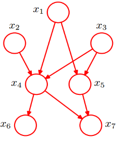
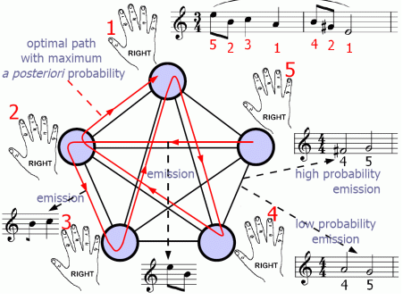
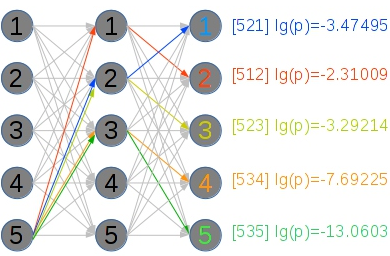

概率图模型是概率论和图论的结合，经常见到的贝叶斯网络、马尔可夫模型、最大熵模型、条件随机场都属于概率图模型，这些模型有效的解决了很多实际问题，比如自然语言处理中的词性标注、实体识别等，书里的描述都公式纵横、晦涩难懂，我们不妨试试轻轻松松的来说一说概率图模型 

 

### 首先我们说说什么是图论
能点进这篇文章说明你一定是有一定数学基础的，所以我做个比喻，你来看看是不是这么回事。糖葫芦吃过吧？几个山楂串在一根杆上，这其实就是一个图。

稍稍正式一点说：图就是把一些孤立的点用线连起来，任何点之间都有可能连着。它区别于树，树是有父子关系，图没有。

再深入一点点：从质上来说，图可以表达的某些事物之间的关联关系，也可以表达的是一种转化关系；从量上来说，它能表达出关联程度，也能表达出转化的可能性大小

图论一般有什么用途呢？著名的七桥问题、四色问题、欧拉定理都是在图论基础上说事儿的

 

### 再说说概率论
概率论从中学到大学再到工作中都在学，它原理很简单：投个硬币出现人头的概率是1/2，最常用的就是条件概率P(B|A)，联合概率P(A,B)，贝叶斯公式:P(B|A)=P(A|B)P(B)/P(A)，各种估计方法。

 

### 提前解释一下概率图模型里的几个常见词汇
贝叶斯(Bayes)：无论什么理论什么模型，只要一提到他，那么里面一定是基于条件概率P(B|A)来做文章的。ps：贝叶斯老爷爷可是18世纪的人物，他的理论到现在还这么火，可见他的影响力绝不下于牛顿、爱因斯坦

马尔可夫(Markov)：无论什么理论什么模型，只要一提到他，那么里面一定有一条链式结构或过程，前n个值决定当前这个值，或者说当前这个值跟前n个值有关

熵(entropy)：熵有火字旁，本来是一个热力学术语，表示物质系统的混乱状态。延伸数学上表达的是一种不确定性。延伸到信息论上是如今计算机网络信息传输的基础理论，不确定性函数是f(p)=-logp，信息熵H(p)=-∑plogp。提到熵必须要提到信息论鼻祖香农(Shannon)

场(field)：只要在数学里见到场，它都是英文里的“域”的概念，也就是取值空间，如果说“随机场”，那么就表示一个随机变量能够赋值的全体空间

 

### 再说概率图模型
概率图模型一般是用图来说明，用概率来计算的。所以为了清晰的说明，我们每一种方法我尽量配个图，并配个公式。

首先，为了脑子里有个体系，我们做一个分类，分成有向图模型和无向图模型，顾名思义，就是图里面的边是否有方向。那么什么样的模型的边有方向，而什么样的没方向呢？这个很好想到，有方向的表达的是一种推演关系，也就是在A的前提下出现了B，这种模型又叫做生成式模型。而没有方向表达的是一种“这样就对了”的关系，也就是A和B同时存在就对了，这种模型又叫做判别式模型。生成式模型一般用联合概率计算(因为我们知道A的前提了，可以算联合概率)，判别式模型一般用条件概率计算(因为我们不知道前提，所以只能"假设"A条件下B的概率)。生成式模型的代表是：n元语法模型、隐马尔可夫模型、朴素贝叶斯模型等。判别式模型的代表是：最大熵模型、支持向量机、条件随机场、感知机模型等

 

### 贝叶斯网络
按照前面说的，提到贝叶斯就是条件概率，所以也就是生成式模型，也就是有向图模型。

为了说明什么是贝叶斯网络，我从网上盗取一个图



 

图中每一个点都可能未True或False，他们的概率是已知的，比如x7的概率需要有x4和x5来决定，可能是这样的
``` 
x4 x5  T   F

T  T   0.5 0.5

T  F   0.4 0.6

F  T   0.7 0.3

F  F   0.2 0.8
``` 
 

那么可以通过上面的贝叶斯网络来估计如果x1为False情况下x6为True的概率：

P(x6=T|x1=F)=P(x6=T,x1=F)/P(x1=F)

这个值继续推导，最终可以由每个节点的概率数据计算求得，这么说来，贝叶斯网络模型可以通过样本学习来估计每个节点的概率，从而达到可以预测各种问题的结果

贝叶斯网络能够在已知有限的、不完整的、不确定信息条件下进行学习推理，所以广泛应用在故障诊断、维修决策、汉语自动分词、词义消歧等问题上


 

### 马尔可夫模型和隐马尔可夫模型
按照前面说的，提到马尔可夫就是一个值跟前面n个值有关，所以也就是条件概率，也就是生成式模型，也就是有向图模型。

继续盗图



 

音乐的每一个音不是随意作出来的，是根据曲子的风格、和弦、大小调式等来决定的，但是因为可选的音高有多种，也就出现了无数美妙的旋律。因为有约束，所以其实可以说新的音和前面的n个音有关，这其实是一个马尔可夫模型可以解释的事情。

马尔可夫模型还可以看成是一个关于时间t的状态转换过程，也就是随机的有限状态机，那么状态序列的概率可以通过计算形成该序列所有状态之间转移弧上的概率乘积得出。

如果说这个马尔可夫是两阶的，那么转移概率可能是这个样子：



 

当然后面的概率只是举了个例子，这种情况由前两列决定的第三列任意值都会有一个概率

我们通过训练样本来得出每一个概率值，这样就可以通过训练出的模型来根据前两个音是什么而预测下一个音是1、2、3、4、5任意一个的概率是多少了，也就是可以自动作曲了，当然这样做出的曲子肯定是一个无线循环的旋律，你猜猜为什么。

 

那么我们再说隐马尔可夫模型，这里的“隐”指的是其中某一阶的信息我们不知道，就像是我们知道人的祖先是三叶虫，但是由三叶虫经历了怎样的演变过程才演变到人的样子我们是不知道的，我们只能通过化石资料了解分布信息，如果这类资料很多，那么就可以利用隐马尔可夫模型来建模，因为缺少的信息较多，所以这一模型的算法比较复杂，比如前向算法、后向算法之类晦涩的东西就不说了。相对于原理，我们更关注它的应用，隐马尔可夫模型广泛应用在词性标注、中文分词等，为什么能用在这两个应用上呢？仔细想一下能看得出来，比如中文分词，最初你是不知道怎么分词的，前面的词分出来了，你才之后后面的边界在哪里，但是当你后面做了分词之后还要验证前面的分词是否正确，这样前后有依赖关系，而不确定中间状态的情况最适合用隐马尔可夫模型来解释

 

### 最大熵模型
按照前面所说的，看到熵那么一定会用到H(p)=-∑plogp，怎么理解最大熵模型呢？我们的最终目的是想知道在某一个信息条件B下，得出某种可能的结果A的最大的概率，也就是条件概率P(A|B)最大的候选结果。因为最大熵就是不确定性最大，其实也就是条件概率最大，所以求最大的条件概率等同于求最大熵，而我们这里的熵其实是H(p)=H(A|B)=-∑p(b)p(a|b)log(p(a|b))，为了使用训练数据做估计，这里的p(a|b)可以通过训练数据的某些特征来估计，比如这些特征是fi(a,b)，那么做模型训练的过程就编程了训练∑λf(a,b)中的λ参数的过程，至此就有些像机器学习的线性回归了，该怎么做就清晰了。所以其实最大熵模型就是利用熵的原理和熵的公式来用另外一种形式来描述具有概率规律的现实的

 

### 条件随机场
场表示取值范围，随机场表示随机变量有取值范围，也就是每个随机变量有固定的取值，条件指的是随机变量的取值由一定的条件概率决定，而这里的条件来自于我们有一些观察值，这是它区别于其他随机场的地方。条件随机场也可以看做是一个无向图模型，它特殊就特殊在给定观察序列X时某个特定的标记序列Y的概率是一个指数函数exp(∑λt+∑μs)，其中t是转移函数，s是状态函数，我们需要训练的是λ和μ。条件随机场主要应用在标注和切分有序数据上，尤其在自然语言处理、生物信息学、机器视觉、网络智能等方面

 

总结一下，概率图模型包括多种结合概率论和图论的模型，根据特定场景特定需求选择不同的模型，每种模型的参数都需要大量样本训练得出，每种模型都是用来根据训练出来的概率做最优结论选择的，比如根据训练出来的模型对句子做最正确的词性标注、实体标注、分词序列等，本文只是从理念上的解释和总结，真的用到某一种模型还是需要深入研究原理和公式推导以及编程实现，那就不是本文这种小篇幅能够解释的完的了，等我们后面要遇到必须用某一种模型来实现时再狠狠地深入一下。