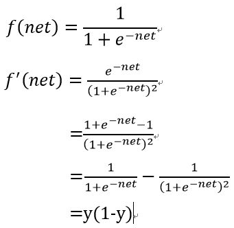
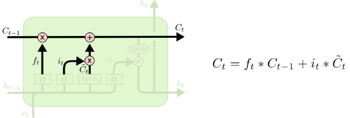
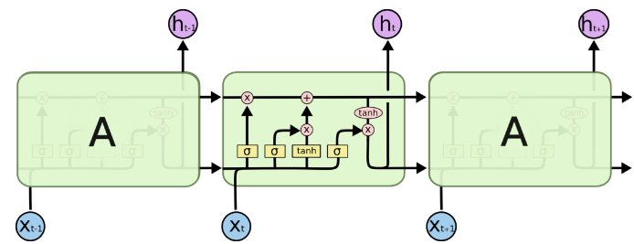

不管是什么样的神经网络算法，总能找到各种语言的库帮助你实现你的需求，但是我们总是看不清那个黑盒子里到底是怎样的一种存在，如果想真正掌握一种算法，最实际的方法就是完全手写出来，本节我就通过两套LSTM的简单实现来分享掌握LSTM的快乐 

 


### 掌握LSTM有什么用

在读代码之前我们要先知道我们读这段代码的意义是什么。LSTM（Long Short Tem Memory）是一种特殊递归神经网络，它的特殊性在于它的神经元的设计能够保存历史记忆，这样可以解决自然语言处理的统计方法中只能考虑最近n个词语而忽略了更久之前的词语的问题。它的用途有：word representation（embedding）(也就是怎么样把词语表达成向量)、sequence to sequence learning（也就是输入一个句子能预测另一个句子）、以及机器翻译、语音识别等

### 100多行原始python代码实现的基于LSTM的二进制加法器

这份代码来源于[anyone-can-code-lstm](https://iamtrask.github.io/2015/11/15/anyone-can-code-lstm/)，国人也做了[翻译](http://blog.csdn.net/zzukun/article/details/49968129)，这里我再次引用意在一边读一边学习一边理解，并从制作聊天机器人的目标上做一些扩充解读，下面我就一句一句的解释（没有缩进，请参考原始代码）：
```py
import copy, numpy as np
np.random.seed(0)
```
最开始引入了numpy库，这是为了矩阵操作的方便
```py
def sigmoid(x):
    output = 1/(1+np.exp(-x))
    return output
```
这是声明sigmoid激活函数，这是神经网络的基础内容，常用的激活函数有sigmoid、tan、relu等，sigmoid的取值范围是[0, 1]，tan的取值范围是[-1,1]，这里的x是一个向量，那么返回的output也是一个向量
```py
def sigmoid_output_to_derivative(output):
    return output*(1-output)
```

这是声明sigmoid的求导函数，那么这个求导函数怎么来的呢？请看下面的推导你就明白了


在这里先说一下这个加法器的思路：二进制的加法是一个一个二进制位相加，同时会记录一个满二进一的进位，那么训练时，随机找个c=a+b就是一个样本，输入a、b输出c就是整个lstm的预测过程，我们要训练的就是由a、b的二进制向c转换的各种转换矩阵和权重等，也就是我们要设计的神经网络
```py
int2binary = {}
```
这里声明了一个词典，用于由整型数字转成二进制，这样存起来是为了不用随时计算，提前存好能够使得读取更快
```py
binary_dim = 8
largest_number = pow(2,binary_dim)
```
这是声明二进制数字的维度，如果是8，那么二进制能表达的最大整数是2^8=256，也就是这里的largest_number
```py
binary = np.unpackbits(
                       np.array([range(largest_number)],dtype=np.uint8).T,axis=1)
for i in range(largest_number):
    int2binary[i] = binary[i]
```
这就是所说的预先把整数到二进制的转换词典存起来
```py
alpha = 0.1
input_dim = 2
hidden_dim = 16
output_dim = 1
```
这里设置了几个参数，alpha是学习速度，input_dim是输入层向量的维度，因为输入a、b两个数，所以是2，hidden_dim是隐藏层向量的维度，也就是隐藏层神经元的个数，output_dim是输出层向量的维度，因为输出一个c，所以是1维。这样从输入层到隐藏层的权重矩阵一定是2*16维的，从隐藏层到输出层的权重矩阵一定是16*1维的，而隐藏层到隐藏层的权重矩阵一定是16*16维的，也就是如下：
```py
synapse_0 = 2*np.random.random((input_dim,hidden_dim)) - 1
synapse_1 = 2*np.random.random((hidden_dim,output_dim)) - 1
synapse_h = 2*np.random.random((hidden_dim,hidden_dim)) - 1
```
这里用2x-1是因为np.random.random会生成从0到1之间的随机浮点数，那么2x-1就是使其取值范围在[-1, 1]
```py
synapse_0_update = np.zeros_like(synapse_0)
synapse_1_update = np.zeros_like(synapse_1)
synapse_h_update = np.zeros_like(synapse_h)
```
这是声明了三个矩阵的更新，也就是δ，后面会用到
```
for j in range(10000):
```
这表示我们要对下面的过程进行10000次迭代
```py
a_int = np.random.randint(largest_number/2)
a = int2binary[a_int]
b_int = np.random.randint(largest_number/2)
b = int2binary[b_int]
c_int = a_int + b_int
c = int2binary[c_int]
```
这里其实是随机生成一个样本，这个样本包含二进制的a、b、c，其中c=a+b，a_int、b_int、c_int分别是是a、b、c对应的整数格式
```py
d = np.zeros_like(c)
```
这个d在后面用来存我们模型对c的预测值
```py
overallError = 0
```
这个是全局误差，用来观察模型效果
```py
layer_2_deltas = list()
```
这用来存储第二层(也就是输出层)的残差，对于输出层，残差计算公式推导如下（公式可以在[这里](http://deeplearning.stanford.edu/wiki/index.php/%E5%8F%8D%E5%90%91%E4%BC%A0%E5%AF%BC%E7%AE%97%E6%B3%95)找到）：


这个公式下面会用到

```py
layer_1_values = list()
layer_1_values.append(np.zeros(hidden_dim))
```
这用来存储第一层(也就是隐藏层)的输出值，首先我们赋0值作为上一个时间的值
```py
for position in range(binary_dim):
```

这里我们来遍历二进制的每一位
```py
X = np.array([[a[binary_dim - position - 1],b[binary_dim - position - 1]]])
y = np.array([[c[binary_dim - position - 1]]]).T
```
这里的X和y分别是样本的输入和输出的二进制值的第position位，其中X对于每个样本有两个值，分别是a和b对应的第position位。把样本拆成每个二进制位用于训练是因为二进制加法中存在进位标记正好适合利用LSTM的长短期记忆来训练，每个样本的8个二进制位刚好是一个时间序列
```py
layer_1 = sigmoid(np.dot(X,synapse_0) + np.dot(layer_1_values[-1],synapse_h))
```
这里使用的公式是Ct = σ(W0·Xt + Wh·Ct-1)
```py
layer_2 = sigmoid(np.dot(layer_1,synapse_1))
```
这里使用的公式是C2 = σ(W1·C1)
```py
layer_2_error = y - layer_2
```
这里计算预测值和真实值的误差
```py
layer_2_deltas.append((layer_2_error)*sigmoid_output_to_derivative(layer_2))
```
这里开始反向传导的过程，通过如下公式计算delta(上面提到的公式用在这里)，并添加到数组layer_2_deltas中，此数组对于每个二进制位(position)有一个值


```py
overallError += np.abs(layer_2_error[0])
```
这里计算累加总误差，后面用于展示和观察
```py
d[binary_dim - position - 1] = np.round(layer_2[0][0])
```
这里存储预测出来的position位的输出值
```py
layer_1_values.append(copy.deepcopy(layer_1))
```
这里存储中间过程生成的隐藏层的值
```py
future_layer_1_delta = np.zeros(hidden_dim)
```
这用来存储用于下一个时间周期用到的隐藏层的历史记忆值，还是先赋一个空值
```py
for position in range(binary_dim):
```
这里我们再次遍历二进制的每一位
```py
X = np.array([[a[position],b[position]]])
```
和前面一样取出X的值，不同的是我们从大位开始做更新，因为反向传导是按时序逆着一级一级更新的
```py
layer_1 = layer_1_values[-position-1]
```
取出这一位对应隐藏层的输出
```py
prev_layer_1 = layer_1_values[-position-2]
```
取出这一位对应隐藏层的上一时序的输出
```py
layer_2_delta = layer_2_deltas[-position-1]
```
取出这一位对应输出层的delta
```py
layer_1_delta = (future_layer_1_delta.dot(synapse_h.T) + layer_2_delta.dot(synapse_1.T)) * sigmoid_output_to_derivative(layer_1)
```
这里其实是基于下面的神经网络反向传导公式，并额外加上了隐藏层的δ值得出的


```py
synapse_1_update += np.atleast_2d(layer_1).T.dot(layer_2_delta)
```
这里累加权重矩阵的更新，基于下面的公式，也就是对权重(权重矩阵)的偏导等于本层的输出与下一层的delta的点乘


```py
synapse_h_update += np.atleast_2d(prev_layer_1).T.dot(layer_1_delta)
```
对前一时序的隐藏层权重矩阵的更新和上面公式类似，只不过改成前一时序的隐藏层输出与本时序的delta的点乘
```py
synapse_0_update += X.T.dot(layer_1_delta)
```
对输入层权重矩阵的更新也是类似
```py
future_layer_1_delta = layer_1_delta
```
记录下本时序的隐藏层的delta用来在下一时序使用
```py
synapse_0 += synapse_0_update * alpha
synapse_1 += synapse_1_update * alpha
synapse_h += synapse_h_update * alpha
```
对权重矩阵做更新
```py
synapse_0_update *= 0
synapse_1_update *= 0
synapse_h_update *= 0
```
更新变量归零
```py
if(j % 1000 == 0):
        print "Error:" + str(overallError)
        print "Pred:" + str(d)
        print "True:" + str(c)
        out = 0
        for index,x in enumerate(reversed(d)):
            out += x*pow(2,index)
        print str(a_int) + " + " + str(b_int) + " = " + str(out)
        print "------------"
```
这里在每训练了1000个样本后输出总误差信息，运行时可以看到收敛的过程

这套代码可以说是LSTM最简单的实现，没有考虑偏置变量，只有两个神经元，因此可以作为一个demo来学习，相比来说下面这个LSTM就是一个比较完善的实现了，几乎是按照论文great intro paper描述的完整实现

 

### 另一个完整的LSTM的python实现

这个实现比上一个更符合LSTM，完全参照论文great intro paper来实现的，不到200行代码，原始代码来源于[nicodjimenez](https://github.com/nicodjimenez/lstm)，作者解释在[这里](http://nicodjimenez.github.io/2014/08/08/lstm.html)，具体过程还可以参考[2015-08-Understanding-LSTMs](http://colah.github.io/posts/2015-08-Understanding-LSTMs/)中的图来理解。下面我就一句一句的解释（具体缩进请参考原始代码）：

```py
import random
import numpy as np
import math

def sigmoid(x):
    return 1. / (1 + np.exp(-x))
```
这里同样是声明sigmoid函数
```py
def rand_arr(a, b, *args):
    np.random.seed(0)
    return np.random.rand(*args) * (b - a) + a
```
用于生成随机矩阵，取值范围是[a,b)，shape用args指定
```py
class LstmParam:
    def __init__(self, mem_cell_ct, x_dim):
        self.mem_cell_ct = mem_cell_ct
        self.x_dim = x_dim
        concat_len = x_dim + mem_cell_ct
        # weight matrices
        self.wg = rand_arr(-0.1, 0.1, mem_cell_ct, concat_len)
        self.wi = rand_arr(-0.1, 0.1, mem_cell_ct, concat_len)
        self.wf = rand_arr(-0.1, 0.1, mem_cell_ct, concat_len)
        self.wo = rand_arr(-0.1, 0.1, mem_cell_ct, concat_len)
        # bias terms
        self.bg = rand_arr(-0.1, 0.1, mem_cell_ct)
        self.bi = rand_arr(-0.1, 0.1, mem_cell_ct)
        self.bf = rand_arr(-0.1, 0.1, mem_cell_ct)
        self.bo = rand_arr(-0.1, 0.1, mem_cell_ct)
        # diffs (derivative of loss function w.r.t. all parameters)
        self.wg_diff = np.zeros((mem_cell_ct, concat_len))
        self.wi_diff = np.zeros((mem_cell_ct, concat_len))
        self.wf_diff = np.zeros((mem_cell_ct, concat_len))
        self.wo_diff = np.zeros((mem_cell_ct, concat_len))
        self.bg_diff = np.zeros(mem_cell_ct)
        self.bi_diff = np.zeros(mem_cell_ct)
        self.bf_diff = np.zeros(mem_cell_ct)
        self.bo_diff = np.zeros(mem_cell_ct)
```
LstmParam类用于传递相关参数，其中mem_cell_ct是lstm的神经元数目，x_dim是输入数据的维度，concat_len是mem_cell_ct与x_dim的长度和，wg是输入节点的权重矩阵(这里的g不要理解为gate，原始论文里有解释)，wi是输入门的权重矩阵，wf是忘记门的权重矩阵，wo是输出门的权重矩阵，bg、bi、bf、bo分别是输入节点、输入门、忘记门、输出门的偏置，wg_diff、wi_diff、wf_diff、wo_diff分别是输入节点、输入门、忘记门、输出门的权重损失，bg_diff、bi_diff、bf_diff、bo_diff分别是输入节点、输入门、忘记门、输出门的偏置损失，这里初始化时会按照矩阵维度初始化，并把损失矩阵归零
```py
    def apply_diff(self, lr = 1):
        self.wg -= lr * self.wg_diff
        self.wi -= lr * self.wi_diff
        self.wf -= lr * self.wf_diff
        self.wo -= lr * self.wo_diff
        self.bg -= lr * self.bg_diff
        self.bi -= lr * self.bi_diff
        self.bf -= lr * self.bf_diff
        self.bo -= lr * self.bo_diff
        # reset diffs to zero
        self.wg_diff = np.zeros_like(self.wg)
        self.wi_diff = np.zeros_like(self.wi)
        self.wf_diff = np.zeros_like(self.wf)
        self.wo_diff = np.zeros_like(self.wo)
        self.bg_diff = np.zeros_like(self.bg)
        self.bi_diff = np.zeros_like(self.bi)
        self.bf_diff = np.zeros_like(self.bf)
        self.bo_diff = np.zeros_like(self.bo)
```

这里定义了权重的更新过程，先减掉损失，再把损失矩阵归零
```py
class LstmState:
    def __init__(self, mem_cell_ct, x_dim):
        self.g = np.zeros(mem_cell_ct)
        self.i = np.zeros(mem_cell_ct)
        self.f = np.zeros(mem_cell_ct)
        self.o = np.zeros(mem_cell_ct)
        self.s = np.zeros(mem_cell_ct)
        self.h = np.zeros(mem_cell_ct)
        self.bottom_diff_h = np.zeros_like(self.h)
        self.bottom_diff_s = np.zeros_like(self.s)
        self.bottom_diff_x = np.zeros(x_dim)
```
LstmState用于存储LSTM神经元的状态，这里包括g、i、f、o、s、h，其中s是内部状态矩阵(可以理解为记忆)，h是隐藏层神经元的输出矩阵
```py
class LstmNode:
    def __init__(self, lstm_param, lstm_state):
        # store reference to parameters and to activations
        self.state = lstm_state
        self.param = lstm_param
        # non-recurrent input to node
        self.x = None
        # non-recurrent input concatenated with recurrent input
        self.xc = None
```
一个LstmNode对应一个样本的输入，其中x就是输入样本的x，xc是用hstack把x和递归的输入节点拼接出来的矩阵（hstack是横着拼成矩阵，vstack就是纵着拼成矩阵）
```py
    def bottom_data_is(self, x, s_prev = None, h_prev = None):
        # if this is the first lstm node in the network
        if s_prev == None: s_prev = np.zeros_like(self.state.s)
        if h_prev == None: h_prev = np.zeros_like(self.state.h)
        # save data for use in backprop
        self.s_prev = s_prev
        self.h_prev = h_prev

        # concatenate x(t) and h(t-1)
        xc = np.hstack((x,  h_prev))
        self.state.g = np.tanh(np.dot(self.param.wg, xc) + self.param.bg)
        self.state.i = sigmoid(np.dot(self.param.wi, xc) + self.param.bi)
        self.state.f = sigmoid(np.dot(self.param.wf, xc) + self.param.bf)
        self.state.o = sigmoid(np.dot(self.param.wo, xc) + self.param.bo)
        self.state.s = self.state.g * self.state.i + s_prev * self.state.f
        self.state.h = self.state.s * self.state.o
        self.x = x
        self.xc = xc
```

这里的bottom和后面遇到的top分别是两个方向，输入样本时认为是从底部输入，反向传导时认为是从顶部开始向底部传导，这里的bottom_data_is是输入样本的过程，首先把x和先前的输入拼接成矩阵，然后用公式wx+b分别计算g、i、f、o的值的值，这里面的激活函数有tanh和sigmoid，实际上可以看下面的图来理解，先说代码里g和i的计算的示意图：


这里的[ht-1,xt]其实就是np.hstack((x,  h_prev))，这里的Ct其实就是g

再看代码里f的计算示意图：

再看代码里s的计算示意图（s对应的是图里的C）：

再看代码里o和h的计算示意图(这里的h的计算公式和代码里有不同，不确定作者为什么要修改这一部分，我们可以尝试按照论文来修改看效果哪个更好)：

所以其实整个就是这样一个过程：


每个时序的神经网络可以理解为有四个神经网络层(图中黄色的激活函数部分)，最左边的是忘记门，它直接生效到记忆C上，第二个是输入门，它主要依赖于输入的样本数据，之后按照一定“比例”影响记忆C，这里的“比例”是通过第三个层(tanh)来实现的，因为它取值范围是[-1,1]可以是正向影响也可以是负向影响，最后一个是输出门，每一时序产生的输出既依赖于输入的样本x和上一时序的输出，还依赖于记忆C，整个设计几乎模仿了生物神经元的记忆功能，应该容易理解。

```py
    def top_diff_is(self, top_diff_h, top_diff_s):
        # notice that top_diff_s is carried along the constant error carousel
        ds = self.state.o * top_diff_h + top_diff_s
        do = self.state.s * top_diff_h
        di = self.state.g * ds
        dg = self.state.i * ds
        df = self.s_prev * ds

        # diffs w.r.t. vector inside sigma / tanh function
        di_input = (1. - self.state.i) * self.state.i * di
        df_input = (1. - self.state.f) * self.state.f * df
        do_input = (1. - self.state.o) * self.state.o * do
        dg_input = (1. - self.state.g ** 2) * dg

        # diffs w.r.t. inputs
        self.param.wi_diff += np.outer(di_input, self.xc)
        self.param.wf_diff += np.outer(df_input, self.xc)
        self.param.wo_diff += np.outer(do_input, self.xc)
        self.param.wg_diff += np.outer(dg_input, self.xc)
        self.param.bi_diff += di_input
        self.param.bf_diff += df_input
        self.param.bo_diff += do_input
        self.param.bg_diff += dg_input

        # compute bottom diff
        dxc = np.zeros_like(self.xc)
        dxc += np.dot(self.param.wi.T, di_input)
        dxc += np.dot(self.param.wf.T, df_input)
        dxc += np.dot(self.param.wo.T, do_input)
        dxc += np.dot(self.param.wg.T, dg_input)

        # save bottom diffs
        self.state.bottom_diff_s = ds * self.state.f
        self.state.bottom_diff_x = dxc[:self.param.x_dim]
        self.state.bottom_diff_h = dxc[self.param.x_dim:]
```
这里是反向传导的过程，这个过程是整个训练过程的核心，如果不了解原理，这部分是不可能理解的，所以我们首先了解一下公式推导：

假设在t时刻lstm输出的预测值为h(t)，而实际的输出值是y(t)，那么他们之间的差别就是损失，我们假设损失函数为l(t) = f(h(t), y(t)) = ||h(t) - y(t)||^2，也就是欧式距离，那么整体损失函数就是

L(t) = ∑l(t)，其中t从1到T，T表示整个事件序列的最大长度

我们的最终目标就是用梯度下降法来让L(t)最小化，也就是找到一个最优的权重w使得L(t)最小，那么权重w在什么情况下L(t)最小呢？就是在：当w发生微小变化时L(t)不再变化，也就是达到局部最优，即L对w的偏导也就是梯度为0

下面我们来分析L对w的微分怎么算


这个公式这样来理解：dL/dw表示当w发生单位变化时L变化了多少，dh(t)/dw表示当w发生单位变化时h(t)变化了多少，dL/dh(t)表示当h(t)发生单位变化时L变化了多少，那么(dL/dh(t)) * (dh(t)/dw)就表示对于第t时序第i个记忆单元当w发生单位变化时L变化了多少，那么把所有由1到M的i和所有由1到T的t累加起来自然就是整体上的dL/dw

下面单独来看左边的dL/dh(t)，它其实可以写成


右面表示：对于第i个记忆单元，当h(t)发生单位变化时，整个从1到T的时序上所有局部损失l的累加和，这其实刚好就是dL/dh(t)，那么实际上h(t)只会影响从t到T这段时序上的局部损失l，所以式子可以写成


下面我们假设L(t)表示从t到T的损失和，那么有L(t) = ∑l(s)，其中s由t到T，那么我们上面的式子可以写成


那么我们上面的梯度公式就可以写成


右边其实就是h(t)对w的导数，下面我们来专门看左边的式子

我们知道L(t) = l(t) + L(t+1)，那么dL(t)/dh(t) = dl(t)/dh(t) + dL(t+1)/dh(t)，右边的式子其实就是LSTM带有记忆的真谛之所在，也就是用下一时序的导数可以得出当前时序的导数，那么我们就按照这个规律来做推导，首先我们计算T时刻的导数然后往前推，在T时刻，dL(T)/dh(T) = dl(T)/dh(T)

为了方便理解，我们暂时先略过上面那段top_diff_is，看之后的一段
```py
class LstmNetwork():
    def __init__(self, lstm_param):
        self.lstm_param = lstm_param
        self.lstm_node_list = []
        # input sequence
        self.x_list = []

    def y_list_is(self, y_list, loss_layer):
        """
        Updates diffs by setting target sequence
        with corresponding loss layer.
        Will *NOT* update parameters.  To update parameters,
        call self.lstm_param.apply_diff()
        """
        assert len(y_list) == len(self.x_list)
        idx = len(self.x_list) - 1
        # first node only gets diffs from label ...
        loss = loss_layer.loss(self.lstm_node_list[idx].state.h, y_list[idx])
        diff_h = loss_layer.bottom_diff(self.lstm_node_list[idx].state.h, y_list[idx])
        # here s is not affecting loss due to h(t+1), hence we set equal to zero
        diff_s = np.zeros(self.lstm_param.mem_cell_ct)
        self.lstm_node_list[idx].top_diff_is(diff_h, diff_s)
        idx -= 1

        ### ... following nodes also get diffs from next nodes, hence we add diffs to diff_h
        ### we also propagate error along constant error carousel using diff_s
        while idx >= 0:
            loss += loss_layer.loss(self.lstm_node_list[idx].state.h, y_list[idx])
            diff_h = loss_layer.bottom_diff(self.lstm_node_list[idx].state.h, y_list[idx])
            diff_h += self.lstm_node_list[idx + 1].state.bottom_diff_h
            diff_s = self.lstm_node_list[idx + 1].state.bottom_diff_s
            self.lstm_node_list[idx].top_diff_is(diff_h, diff_s)
            idx -= 1

        return loss
```
重点关注这里的diff_h(表达的是预测结果误差发生单位变化时损失L是多少，也就相当于公式中的dL(t)/dh(t)的一个数值计算)，我们看到这里的过程是由idx从T往前遍历到1，计算loss_layer.bottom_diff和下一个时序的bottom_diff_h的和作为diff_h(其中第一次遍历即T时不加bottom_diff_h和公式一样)

其中loss_layer.bottom_diff的实现如下：
```py
    def bottom_diff(self, pred, label):
        diff = np.zeros_like(pred)
        diff[0] = 2 * (pred[0] - label)
        return diff
```
这里求的就是l(t) = f(h(t), y(t)) = ||h(t) - y(t)||^2的导数l'(t) = 2 * (h(t) - y(t))

与上面推导dL(t)/dh(t) 的过程类似，我们来推导dL(t)/ds(t) 。当s(t)发生变化时，L(t)的变化来源于s(t)影响了h(t)和h(t+1)，从而影响了L(t)，即


因为h(t+1)不会影响l(t)，所以


因此有


这里如果能求得左边的式子(dL(t)/dh(t)) * (dh(t)/ds(t))，那么就可以由t+1到t来逐级反推dL(t)/ds(t)了

下面我们就来看怎么来计算左边的式子

因为我们神经元设计有：self.state.h = self.state.s * self.state.o也就是h(t) = s(t) * o(t)，那么dh(t)/ds(t) = o(t)，而因为dL(t)/dh(t)就是top_diff_h，所以有：


所以得到


这回可以回来看top_diff_is代码了，我自己读到这里的top和bottom的时候，没明白含义，所以特地咨询了代码原作者，他的解释是：Bottom means input to the layer, top means output of the layer. Caffe also uses this terminology.也就是说bottom表示神经网络层的输入，top表示神经网络层的输出，和caffe中概念一致
```py
def top_diff_is(self, top_diff_h, top_diff_s):
```
首先看传递过来的两个参数：top_diff_h表示当前t时序的dL(t)/dh(t), top_diff_s表示t+1时序记忆单元的dL(t)/ds(t)
```py
        ds = self.state.o * top_diff_h + top_diff_s
        do = self.state.s * top_diff_h
        di = self.state.g * ds
        dg = self.state.i * ds
        df = self.s_prev * ds
```
这里面的前缀d表达的是误差L对某一项的导数(directive)

其中ds一行是在根据上面的公式dL(t)/ds(t)计算当前t时序的dL(t)/ds(t)

其中do一行是计算dL(t)/do(t)，因为h(t) = s(t) * o(t)，所以dh(t)/do(t) = s(t)，所以dL(t)/do(t) = (dL(t)/dh(t)) * (dh(t)/do(t)) = top_diff_h * s(t)

其中di一行是计算dL(t)/di(t)，考虑到


换个符号表示就是
```py
s(t) = f(t) * s(t-1) + i(t) * g(t)
```
所以dL(t)/di(t) = (dL(t)/ds(t)) * (ds(t)/di(t)) = ds * g(t)

其中dg一行是计算dL(t)/dg(t)，同上有dL(t)/dg(t) = (dL(t)/ds(t)) * (ds(t)/dg(t)) = ds * i(t)

其中df一行是计算dL(t)/df(t)，同上有dL(t)/df(t) = (dL(t)/ds(t)) * (ds(t)/df(t)) = ds * s(t-1)
```py
di_input = (1. - self.state.i) * self.state.i * di
df_input = (1. - self.state.f) * self.state.f * df
do_input = (1. - self.state.o) * self.state.o * do
dg_input = (1. - self.state.g ** 2) * dg
```
前三行用了sigmoid函数的导数，后一行用了tanh函数的导数。以第一行di_input为例，(1. - self.state.i) * self.state.i是sigmoid导数，表示当i神经元的输入发生单位变化时输出值有多大变化，那么再乘以di就表示当i神经元的输入发生单位变化时误差L(t)发生多大变化，也就是dL(t)/d i_input(t)，下面几个都同理
```py
self.param.wi_diff += np.outer(di_input, self.xc)
self.param.wf_diff += np.outer(df_input, self.xc)
self.param.wo_diff += np.outer(do_input, self.xc)
self.param.wg_diff += np.outer(dg_input, self.xc)
self.param.bi_diff += di_input
self.param.bf_diff += df_input
self.param.bo_diff += do_input
self.param.bg_diff += dg_input
```
这里的w*_diff是权重矩阵的误差，b*_diff是偏置的误差，用于做更新，这里面为什么是d*_input和xc的外积没看懂
```py
dxc = np.zeros_like(self.xc)
dxc += np.dot(self.param.wi.T, di_input)
dxc += np.dot(self.param.wf.T, df_input)
dxc += np.dot(self.param.wo.T, do_input)
dxc += np.dot(self.param.wg.T, dg_input)
```
这里是在累加输入x的diff，因为x在四处起作用，所以四处的diff加和之后才算作x的diff
```py
self.state.bottom_diff_s = ds * self.state.f
self.state.bottom_diff_x = dxc[:self.param.x_dim]
self.state.bottom_diff_h = dxc[self.param.x_dim:]
```
这里bottom_diff_s是根据如下公式得出的推导关系，也就是在t-1时序上s的变化和t时序上s的变化时f倍的关系


因为dxc是x和h横向合并出来的矩阵，所以分别取出两部分的diff信息就是bottom_diff_x和bottom_diff_h（这里面的bottom_diff_x代码里面没有真正作用）
```py
def x_list_clear(self):
    self.x_list = []

def x_list_add(self, x):
    self.x_list.append(x)
    if len(self.x_list) > len(self.lstm_node_list):
        # need to add new lstm node, create new state mem
        lstm_state = LstmState(self.lstm_param.mem_cell_ct, self.lstm_param.x_dim)
        self.lstm_node_list.append(LstmNode(self.lstm_param, lstm_state))

    # get index of most recent x input
    idx = len(self.x_list) - 1
    if idx == 0:
        # no recurrent inputs yet
        self.lstm_node_list[idx].bottom_data_is(x)
    else:
        s_prev = self.lstm_node_list[idx - 1].state.s
        h_prev = self.lstm_node_list[idx - 1].state.h
        self.lstm_node_list[idx].bottom_data_is(x, s_prev, h_prev)
```
这一部分是添加训练样本的过程，也就是输入x数据，那么整个执行过程如下：
```py
def example_0():
    # learns to repeat simple sequence from random inputs
    np.random.seed(0)

    # parameters for input data dimension and lstm cell count
    mem_cell_ct = 100
    x_dim = 50
    concat_len = x_dim + mem_cell_ct
    lstm_param = LstmParam(mem_cell_ct, x_dim)
    lstm_net = LstmNetwork(lstm_param)
    y_list = [-0.5,0.2,0.1, -0.5]
    input_val_arr = [np.random.random(x_dim) for _ in y_list]

    for cur_iter in range(100):
        print "cur iter: ", cur_iter
        for ind in range(len(y_list)):
            lstm_net.x_list_add(input_val_arr[ind])
            print "y_pred[%d] : %f" % (ind, lstm_net.lstm_node_list[ind].state.h[0])

        loss = lstm_net.y_list_is(y_list, ToyLossLayer)
        print "loss: ", loss
        lstm_param.apply_diff(lr=0.1)
        lstm_net.x_list_clear()
```
首先初始化LstmParam，指定记忆存储单元数为100，指定输入样本x维度是50，下面初始化一个LstmNetwork用于训练模型，然后生成了4组各50个随机数，并分别以[-0.5,0.2,0.1, -0.5]作为y值来训练，每次喂给50个随机数和一个y值，共迭代100次

这个测试样例最终执行效果自己来尝试吧

 

### 利用lstm在输入一串连续质数时预估下一个质数

为了测试这个强大的lstm，我写了这样一个小测试，首先生成100以内质数，然后循环地拿出50个质数序列作为x，第51个质数作为y，这样拿出10个样本参与训练1w次，均方误差由一开始的0.17973最终达到了1.05172e-06，几乎完全正确，效果相当赞啊，程序如下：
```py
import numpy as np
import sys

from lstm import LstmParam, LstmNetwork

class ToyLossLayer:
    """
    Computes square loss with first element of hidden layer array.
    """
    @classmethod
    def loss(self, pred, label):
        return (pred[0] - label) ** 2

    @classmethod
    def bottom_diff(self, pred, label):
        diff = np.zeros_like(pred)
        diff[0] = 2 * (pred[0] - label)
        return diff

class Primes:
    def __init__(self):
        self.primes = list()
        for i in range(2, 100):
            is_prime = True
            for j in range(2, i-1):
                if i % j == 0:
                    is_prime = False
            if is_prime:
                self.primes.append(i)
        self.primes_count = len(self.primes)
    def get_sample(self, x_dim, y_dim, index):
        result = np.zeros((x_dim+y_dim))
        for i in range(index, index + x_dim + y_dim):
            result[i-index] = self.primes[i%self.primes_count]/100.0
        return result


def example_0():
    mem_cell_ct = 100
    x_dim = 50
    concat_len = x_dim + mem_cell_ct
    lstm_param = LstmParam(mem_cell_ct, x_dim)
    lstm_net = LstmNetwork(lstm_param)

    primes = Primes()
    x_list = []
    y_list = []
    for i in range(0, 10):
        sample = primes.get_sample(x_dim, 1, i)
        x = sample[0:x_dim]
        y = sample[x_dim:x_dim+1].tolist()[0]
        x_list.append(x)
        y_list.append(y)

    for cur_iter in range(10000):
        if cur_iter % 1000 == 0:
            print "y_list=", y_list
        for ind in range(len(y_list)):
            lstm_net.x_list_add(x_list[ind])
            if cur_iter % 1000 == 0:
                print "y_pred[%d] : %f" % (ind, lstm_net.lstm_node_list[ind].state.h[0])

        loss = lstm_net.y_list_is(y_list, ToyLossLayer)
        if cur_iter % 1000 == 0:
            print "loss: ", loss
        lstm_param.apply_diff(lr=0.01)
        lstm_net.x_list_clear()

if __name__ == "__main__":
    example_0()
```
最终的运行效果最后一次迭代结果输出如下(注：这里的质数列表我全都除以了100，因为这个代码训练的数据必须是小于1的数值)，可以看到预测基本上正确：
```py
y_list= [0.02, 0.03, 0.05, 0.07, 0.11, 0.13, 0.17, 0.19, 0.23, 0.29]
y_pred[0] : 0.019828
y_pred[1] : 0.030286
y_pred[2] : 0.049671
y_pred[3] : 0.070302
y_pred[4] : 0.109682
y_pred[5] : 0.130395
y_pred[6] : 0.169550
y_pred[7] : 0.190424
y_pred[8] : 0.229697
y_pred[9] : 0.290101
loss:  1.05172051911e-06
```