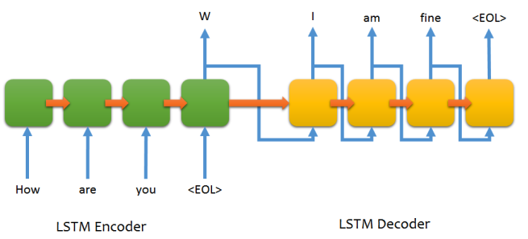

tensorflow自带的seq2seq模型基于one-hot的词嵌入，每个词用一个数字代替不足以表示词与词之间的关系，word2vec通过多维向量来做词嵌入，能够表示出词之间的关系，比如：男-女&asymp;王子-公主。基于seq2seq的思想，利用多维词向量来实现模型，预期会有更高的准确性。 

### seq2seq模型原理

主要参考[《Sequence to Sequence Learning with Neural Networks》](http://cn.arxiv.org/pdf/1409.3215.pdf)这篇论文，核心思想如下图：


ABC是输入语句，WXYZ是输出语句，EOS是标识一句话结束，图中的训练单元是lstm，lstm的特点是有长短时记忆，所以能够根据输入的多个字来确定后面的多个字，有关lstm的知识可以参考《http://deeplearning.net/tutorial/lstm.html》

上面的模型中编码器和解码器共用了同一个lstm层，也就是共享了参数，牛人们尝试把他们分开像https://github.com/farizrahman4u/seq2seq中提到的样子：



其中绿色是编码器，黄色是解码器，橙色的箭头传递的是lstm层的状态信息也就是记忆信息，编码器唯一传给解码器的就是这个状态信息

我们看到解码器每一时序的输入都是前一个时序的输出，从整体上来看就是：我通过不同时序输入“How are you <EOL>”，模型就能自动一个字一个字的输出“W I am fine <EOL>”，这里的W是一个特殊的标识，它既是编码器最后的输出，同时又是解码器的一个触发信号

那么我们训练的时候输入的X,Y应该是什么呢？X="How are you <EOL>"，Y="W I am fine <EOL>"?

这是不行的，因为在解码器还没有训练出靠谱的参数之前，我们无法保证第一个时序的输出就是“I”，那么传给第二个时序的输入就不一定是I，同样第三、四个时序的输入就无法保证是am和fine，那么是无法训练出想要的模型的

我们要这样来做：我们直接把解码器中每一时序的输入强制改为"W I am fine"，也就是把这部分从我们训练样本的输入X中传过来，而Y依然是预测输出的"W I am fine <EOL>"，这样训练出来的模型就是我们设计的编码器解码器模型了

那么在使用训练好的模型做预测的时候，我们改变处理方式：在解码时以前一时序的输出为输入做预测，这样就能输出我们希望输出的"W I am fine <EOL>"了

基于以上的原理，下面开始我们的工程实践

### 语料准备工作

准备至少300w的聊天语料用于词向量的训练和seq2seq模型的训练，语料越丰富训练出来的词向量质量越好，如果想通过影视剧字幕来获取语料可以参考[《自己动手做聊天机器人 二十九-重磅：近1GB的三千万聊天语料供出》](29.corpus-1g)

获取到原始语料后需要做一些加工处理，首先需要做切词，方法如下：

```sh
python word_segment.py ./corpus.raw ./corpus.segment
```

其中word_segment.py是我写的切词工具，仅供参考

之后要把切词好的文件转成“|”分隔的问答对，如下：

```sh
cat ./corpus.segment | awk '{if(last!="")print last"|"$0;last=$0}' | sed 's/| /|/g' > ./corpus.segment.pair
```

这样语料准备工作就齐全了

### 训练词向量
我们直接利用google的word2vec来训练词向量，如下：

```sh
word2vec -train ./corpus.segment -output vectors.bin -cbow 1 -size 200 -window 8 -negative 25 -hs 0 -sample 1e-5 -threads 20 -binary 1 -iter 15
```

其中corpus.raw是原始语料数据，vectors.bin是生成的词向量二进制文件

了解word2vec的原理请见《自己动手做聊天机器人 二十五-google的文本挖掘深度学习工具word2vec的实现原理》

生成的词向量二进制加载方法可以参考我写的：word_vectors_loader.py

### 创建模型

下面就是重点的模型创建过程，这里面我们直接使用tensorflow+tflearn库来实现：

```python
# 首先我们为输入的样本数据申请变量空间，如下。
# 其中self.max_seq_len是指一个切好词的句子最多包含多少个词，
# self.word_vec_dim是词向量的维度，这里面shape指定了输入数据是不确定数量的样本，
# 每个样本最多包含max_seq_len*2个词，每个词用word_vec_dim维浮点数表示。
# 这里面用2倍的max_seq_len是因为我们训练是输入的X既要包含question句子又要包含answer句子
input_data = tflearn.input_data(shape=[None, self.max_seq_len*2, self.word_vec_dim], dtype=tf.float32, name = "XY")
# 然后我们将输入的所有样本数据的词序列切出前max_seq_len个，也就是question句子部分，作为编码器的输入
encoder_inputs = tf.slice(input_data, [0, 0, 0], [-1, self.max_seq_len, self.word_vec_dim], name="enc_in")
# 再取出后max_seq_len-1个，也就是answer句子部分，作为解码器的输入。
# 注意，这里只取了max_seq_len-1个，是因为还要在前面拼上一组GO标识来告诉解码器我们要开始解码了，
# 也就是下面加上go_inputs拼成最终的go_inputs
decoder_inputs_tmp = tf.slice(input_data, [0, self.max_seq_len, 0], [-1, self.max_seq_len-1, self.word_vec_dim], name="dec_in_tmp")
go_inputs = tf.ones_like(decoder_inputs_tmp)
go_inputs = tf.slice(go_inputs, [0, 0, 0], [-1, 1, self.word_vec_dim])
decoder_inputs = tf.concat(1, [go_inputs, decoder_inputs_tmp], name="dec_in")
# 之后开始编码过程，返回的encoder_output_tensor展开成tflearn.regression回归可以识别的形如(?, 1, 200)的向量；返回的states后面传入给解码器
(encoder_output_tensor, states) = tflearn.lstm(encoder_inputs, self.word_vec_dim, return_state=True, scope='encoder_lstm')
encoder_output_sequence = tf.pack([encoder_output_tensor], axis=1)
# 取出decoder_inputs的第一个词，也就是GO
first_dec_input = tf.slice(decoder_inputs, [0, 0, 0], [-1, 1, self.word_vec_dim])
# 将其输入到解码器中，如下，解码器的初始化状态为编码器生成的states，
# 注意：这里的scope='decoder_lstm'是为了下面重用同一个解码器
decoder_output_tensor = tflearn.lstm(first_dec_input, self.word_vec_dim, initial_state=states, return_seq=False, reuse=False, scope='decoder_lstm')
# 暂时先将解码器的第一个输出存到decoder_output_sequence_list中供最后一起输出
decoder_output_sequence_single = tf.pack([decoder_output_tensor], axis=1)
decoder_output_sequence_list = [decoder_output_tensor]
# 接下来我们循环max_seq_len-1次，不断取decoder_inputs的一个个词向量作为下一轮解码器输入，
# 并将结果添加到decoder_output_sequence_list中，
# 这里面的reuse=True, scope='decoder_lstm'说明和上面第一次解码用的是同一个lstm层
for i in range(self.max_seq_len-1):
   next_dec_input = tf.slice(decoder_inputs, [0, i+1, 0], [-1, 1, self.word_vec_dim])
   decoder_output_tensor = tflearn.lstm(next_dec_input, self.word_vec_dim, return_seq=False, reuse=True, scope='decoder_lstm')
   decoder_output_sequence_single = tf.pack([decoder_output_tensor], axis=1)
   decoder_output_sequence_list.append(decoder_output_tensor)
# 下面我们把编码器第一个输出和解码器所有输出拼接起来，作为tflearn.regression回归的输入
decoder_output_sequence = tf.pack(decoder_output_sequence_list, axis=1)
real_output_sequence = tf.concat(1, [encoder_output_sequence, decoder_output_sequence])
net = tflearn.regression(real_output_sequence, optimizer='sgd', learning_rate=0.1, loss='mean_square')
model = tflearn.DNN(net)
```

至此模型创建完成，让我们汇总一下里面的思想：

1. 训练输入的X、Y分别是编码器解码器的输入和预测的输出；
2. X切分两半，前一半是编码器输入，后一半是解码器输入；
3. 编码解码器输出的预测值用Y做回归训练
4. 训练时通过样本的真实值作为解码器输入，实际预测时将不会有上图中WXYZ部分，因此上一时序的输出将作为下一时序的输入(后面会详述预测的实现)

### 训练模型

下面我们来实例化模型并喂数据做训练，如下：

```python
model = self.model()
model.fit(trainXY, trainY, n_epoch=1000, snapshot_epoch=False, batch_size=1)
model.load('./model/model')
```

这里的trainXY和trainY通过加载上面我们准备的语料来赋值


首先我们加载词向量并存到word_vector_dict中，然后读取语料文件并挨个词查word_vector_dict并赋值向量给question_seq和answer_seq，如下：

```python
def init_seq(input_file):
    """读取切好词的文本文件，加载全部词序列
    """
    file_object = open(input_file, 'r')
    vocab_dict = {}
    while True:
        question_seq = []
        answer_seq = []
        line = file_object.readline()
        if line:
            line_pair = line.split('|')
            line_question = line_pair[0]
            line_answer = line_pair[1]
            for word in line_question.decode('utf-8').split(' '):
                if word_vector_dict.has_key(word):
                    question_seq.append(word_vector_dict[word])
            for word in line_answer.decode('utf-8').split(' '):
                if word_vector_dict.has_key(word):
                    answer_seq.append(word_vector_dict[word])
        else:
            break
        question_seqs.append(question_seq)
        answer_seqs.append(answer_seq)
    file_object.close()
```

有了question_seq和answer_seq，我们来构造trainXY和trainY，如下：

```python
    def generate_trainig_data(self):
        xy_data = []
        y_data = []
        for i in range(len(question_seqs)):
            question_seq = question_seqs[i]
            answer_seq = answer_seqs[i]
            if len(question_seq) < self.max_seq_len and len(answer_seq) < self.max_seq_len:
                sequence_xy = [np.zeros(self.word_vec_dim)] * (self.max_seq_len-len(question_seq)) + list(reversed(question_seq))
                sequence_y = answer_seq + [np.zeros(self.word_vec_dim)] * (self.max_seq_len-len(answer_seq))
                sequence_xy = sequence_xy + sequence_y
                sequence_y = [np.ones(self.word_vec_dim)] + sequence_y
                xy_data.append(sequence_xy)
                y_data.append(sequence_y)
        return np.array(xy_data), np.array(y_data)
```

构造了训练数据也创建好了模型，训练的效果如下：

```sh
[root@centos #] python my_seq2seq_v2.py train
begin load vectors
words = 70937
size = 200
load vectors finish
---------------------------------
Run id: 9PZWKM
Log directory: /tmp/tflearn_logs/
---------------------------------
Training samples: 368
Validation samples: 0
--
Training Step: 47  | total loss: 0.62260
| SGD | epoch: 001 | loss: 0.62260 -- iter: 047/368
```

最终会生成./model/model模型文件

### 效果预测

训练好模型，我们希望能输入一句话来预测一下回答，如下：

```python
predict = model.predict(testXY)
```

因为我们只有question没有answer，所以testXY中是没有Y部分的，所以需要在程序中做一些改变，即用上一句的输出作为下一句的输入，如下：

```python
for i in range(self.max_seq_len-1):
   # next_dec_input = tf.slice(decoder_inputs, [0, i+1, 0], [-1, 1, self.word_vec_dim])这里改成下面这句
   next_dec_input = decoder_output_sequence_single
   decoder_output_tensor = tflearn.lstm(next_dec_input, self.word_vec_dim, return_seq=False, reuse=True, scope='decoder_lstm')
   decoder_output_sequence_single = tf.pack([decoder_output_tensor], axis=1)
   decoder_output_sequence_list.append(decoder_output_tensor)
```

因为词向量是多维浮点数，预测出的词向量需要通过余弦相似度来匹配，余弦相似度匹配方法如下：

```python
def vector2word(vector):
    max_cos = -10000
    match_word = ''
    for word in word_vector_dict:
        v = word_vector_dict[word]
        cosine = vector_cosine(vector, v)
        if cosine > max_cos:
            max_cos = cosine
            match_word = word
    return (match_word, max_cos)
```

其中的vector_cosine实现如下：

```python
def vector_cosine(v1, v2):
    if len(v1) != len(v2):
        sys.exit(1)
    sqrtlen1 = vector_sqrtlen(v1)
    sqrtlen2 = vector_sqrtlen(v2)
    value = 0
    for item1, item2 in zip(v1, v2):
        value += item1 * item2
    return value / (sqrtlen1*sqrtlen2)
```

其中的vector_sqrtlen实现如下：
```python
def vector_sqrtlen(vector):
    len = 0
    for item in vector:
        len += item * item
    len = math.sqrt(len)
    return len
```

预测效果如下：

```
输入是“真 讨厌”
```

预测结果：
```sh
[root@centos #] python my_seq2seq_v2.py test test.data
begin load vectors
words = 70937
size = 200
load vectors finish
predict answer
竟然 0.796628661264 8.13188244428
是 0.361905373571 4.72316883181
你 0.416023172832 3.78265507983
啊 0.454288467277 3.13229596833
不是 0.424590214456 2.90688231062
你 0.489174557107 2.62733802498
啊 0.501460288258 2.87990178439
你 0.560230783333 3.09066126524
```

输出的第一列是预测的每个时序产生的词，第二列是预测输出向量和最近的词向量的余弦相似度，第三列是预测向量的欧氏距离

因为我们设计的max_seq_len是定长8，所以输出的序列最后会多余一些字，可以根据余弦相似度或者其他指标设定一个阈值来截断

以上列出的是部分代码，全部代码分享在my_seq2seq_v2.py欢迎点击观看