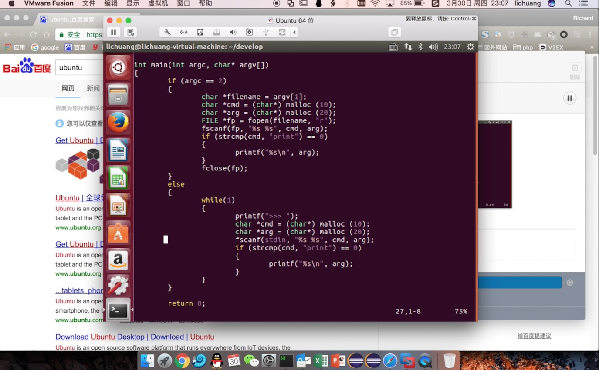

ython是做机器学习最常用并必须掌握的一种语言，本篇视频教程首先演示了虚拟机中安装ubuntu和部署开发环境，并描述了虚拟机工作原理，之后演示开发了一个仿python的解释器来深入理解python的工作原理，最后通过手把手演示讲解了python的变量、分支、循环、函数、复杂数据结构、输入输出、异常、类，以及开源库的安装和使用方法 

 

### 视频大纲

* 虚拟机与操作系统
* 开发一个仿python的解释器
* python的变量、函数、分支、循环
* python的复杂数据结构、输入输出、异常、类、开源库
 

### 视频截屏

时长1小时12分

 

### 视频获取方式

考虑到个人的知识整理、视频录制、视频剪辑、以及知识本身的价值，形式上收取9.9元的苦力费以表支持，希望大家多多理解，也算是对我的鼓励，获取方式比较简单，请刷下方微信或支付宝二维码，支付9.9元，之后把订单号以如下任意方式发送给我，我会把视频下载地址奉上(一般我会在下一个工作日统一回复)：

1. 把支付订单号的后六位或截图发到我的邮箱shareditor.com@gmail.com，邮件标题请注明：“视频教程之环境搭建与python基础”；
2. 在本页下方留言，附上支付订单号的后六位及你的邮箱地址。

另外，欢迎关注我的微信公众号SharEDITor(也可以扫本网页中的公众号二维码)，更欢迎打赏

我还创建了一个聊天机器人技术交流分享微信群，扫如下二维码可以入群

如果无法扫码可以加我微信号warmheartli并说明“加聊天机器人群”，我会给您发送群邀请