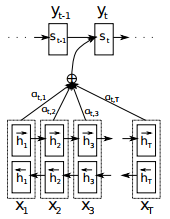
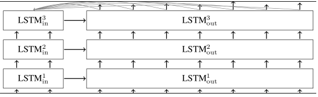
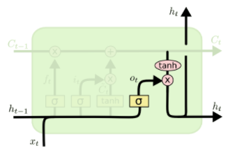
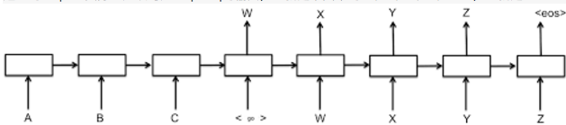
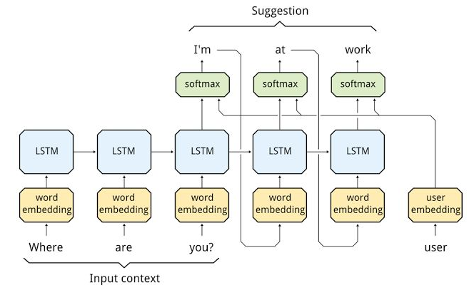

经过几个月的不断试错不断编码，终于整理出一套相对完备的理论和一套效果还不错的代码供大家把玩，训练了10个小时后效果请见文章末尾，代码已分享到github 

### 什么是神经网络

这本小书一定要看：《Make Your Own Neural Network》，老外写的，200多页，没找到中文译本，原版百度一下可以下载到，他用非常通俗易懂的描述讲解了人工神经网络的原理并用代码实现，而且试验效果非常好，作为深度学习入门非常值得推荐。

### 什么是循环神经网络和LSTM

可以参考我的这篇文章自己动手做聊天机器人 二十六-图解递归神经网络(RNN)，或者直接看Christopher Olah的[2015-08-Understanding-LSTMs](http://colah.github.io/posts/2015-08-Understanding-LSTMs/)，这篇博文被业界引用无数次了，经典中的经典。

### 什么是seq2seq模型

seq2seq是基于循环神经网络的一种序列到序列模型，语言翻译、自动问答等都属于序列到序列的场景，都可以使用seq2seq模型，用seq2seq实现聊天机器人的原理可以看下[这篇文章](http://suriyadeepan.github.io/2016-06-28-easy-seq2seq/)。tensorflow中已经有实现好的api供我们使用，但因为参数较多、原理复杂，理解起来比较晦涩，本文就让我带着大家一步一步探索并使用。

### 什么是attention模型

attention模型(注意力模型)是为了解决seq2seq中解码器只接受编码器最后一个输出而远离了之前的输出导致的信息丢失的问题，从原理上讲，一个回答一般是基于问题中一些关键位置的信息，也就是注意力集中的地方，具体细节可以看下[这里](http://www.wildml.com/2016/01/attention-and-memory-in-deep-learning-and-nlp/)

### 用tensorflow的seq2seq制作你自己的聊天机器人

到这里，假设你已经掌握了上面的理论部分，现在我们直接锁定在tensorflow提供给我们的强大api上。想真正利用好tensorflow必须理解好它的重要接口及其所有参数，所以第一步我们找到我们这次要使用的最[关键的接口](https://www.tensorflow.org/api_docs/python/tf/contrib/legacy_seq2seq/embedding_attention_seq2seq)：

```python
embedding_attention_seq2seq(
    encoder_inputs,
    decoder_inputs,
    cell,
    num_encoder_symbols,
    num_decoder_symbols,
    embedding_size,
    num_heads=1,
    output_projection=None,
    feed_previous=False,
    dtype=None,
    scope=None,
    initial_state_attention=False
)
```

为了说明这个接口的功能，先来看一下它所涉及到的模型结构，如下所示：


参数encoder_inputs是一个list，list中每一项是1D的Tensor，这个Tensor的shape是[batch_size]，Tensor中每一项是一个整数，类似这样：

```python
[array([0, 0, 0, 0], dtype=int32), 
array([0, 0, 0, 0], dtype=int32), 
array([8, 3, 5, 3], dtype=int32), 
array([7, 8, 2, 1], dtype=int32), 
array([6, 2, 10, 9], dtype=int32)]
```

其中的5个array，表示一句话的长度是5个词

其中每个array里有4个数，表示batch是4，也就是一共4个样本。那么可以看出第一个样本是[[0],[0],[8],[7],[6]]，第二个样本是[[0],[0],[3],[8],[2]]，这里的数字是用来区分不同词的一个id，一般通过统计得出，一个id表示一个词

同理，参数***decoder_inputs***也是和***encoder_inputs***一样结构，不赘述

参数***cell***是***tf.nn.rnn_cell.RNNCell***类型的循环神经网络单元，可以用***tf.contrib.rnn.BasicLSTMCell***、***tf.contrib.rnn.GRUCell***

参数num_encoder_symbols是一个整数，表示encoder_inputs中的整数词id的数目，同理num_decoder_symbols表示decoder_inputs中整数词id的数目

embedding_size表示在内部做word embedding时转成几维向量，需要和RNNCell的size大小相等

num_heads表示在attention_states中的抽头数量

output_projection是一个(W, B)结构的tuple，W是shape为[output_size x num_decoder_symbols]的weight矩阵，B是shape为[num_decoder_symbols]的偏置向量，那么每个RNNCell的输出经过WX+B就可以映射成num_decoder_symbols维的向量，这个向量里的值表示的是任意一个decoder_symbol的可能性，也就是softmax

feed_previous表示decoder_inputs是我们直接提供训练数据的输入，还是用前一个RNNCell的输出映射出来的，如果feed_previous为True，那么就是用前一个RNNCell的输出，并经过WX+B映射成

dtype是RNN状态数据的类型，默认是tf.float32

scope是子图的命名，默认是“embedding_attention_seq2seq”

initial_state_attention表示是否初始化attentions，默认为否，表示全都初始化为0

它的返回值是一个(outputs, state)结构的tuple，其中outputs是一个长度为句子长度(词数，与上面encoder_inputs的list长度一样)的list，list中每一项是一个2D的tf.float32类型的Tensor，第一维度是样本数，比如4个样本则有四组Tensor，每个Tensor长度是embedding_size，像下面的样子：

```python
  [
    array([
      [-0.02027004, -0.017872  , -0.00233014, -0.0437047 ,  0.00083584,
      0.01339234,  0.02355197,  0.02923143],
      [-0.02027004, -0.017872  , -0.00233014, -0.0437047 ,  0.00083584,
      0.01339234,  0.02355197,  0.02923143],
      [-0.02027004, -0.017872  , -0.00233014, -0.0437047 ,  0.00083584,
      0.01339234,  0.02355197,  0.02923143],
      [-0.02027004, -0.017872  , -0.00233014, -0.0437047 ,  0.00083584,
      0.01339234,  0.02355197,  0.02923143]
    ],dtype=float32),
    array([
    ......
    ],dtype=float32),  
    array([
    ......
    ],dtype=float32),  
    array([
    ......
    ],dtype=float32),  
    array([
    ......
    ],dtype=float32),  
  ]
```

其实这个outputs可以描述为5*4*8个浮点数，5是句子长度，4是样本数，8是词向量维数

下面再看返回的state，它是num_layers个LSTMStateTuple组成的大tuple，这里num_layers是初始化cell时的参数，表示神经网络单元有几层，一个由3层LSTM神经元组成的encoder-decoder多层循环神经网络是像下面这样的网络结构：



encoder_inputs输入encoder的第一层LSTM神经元，这个神经元的output传给第二层LSTM神经元，第二层的output再传给第三层，而encoder的第一层输出的state则传给decoder第一层的LSTM神经元，依次类推，如上图所示

回过头来再看LSTMStateTuple这个结构，它是由两个Tensor组成的tuple，第一个tensor命名为c，由4个8维向量组成(4是batch, 8是state_size也就是词向量维度)， 第二个tensor命名为h，同样由4个8维向量组成

这里的c和h如下所示：



c是传给下一个时序的存储数据，h是隐藏层的输出，这里的计算公式是


在tensorflow代码里也有对应的实现：

```python
concat = _linear([inputs, h], 4 * self._num_units, True)
i, j, f, o = array_ops.split(value=concat, num_or_size_splits=4, axis=1)
new_c = (c * sigmoid(f + self._forget_bias) + sigmoid(i) * self._activation(j))
new_h = self._activation(new_c) * sigmoid(o)
```

事实上，如果我们直接使用embedding_attention_seq2seq来做训练，返回的state一般是用不到的

下面，我们就来想办法构造这些输入参数来训练一个seq2seq模型出来

我们以1、3、5、7、9……奇数序列为例来构造样本，比如两个样本是[[1,3,5],[7,9,11]]和[[3,5,7],[9,11,13]]，相当于我们的：
```python
train_set = [[[1, 3, 5], [7, 9, 11]], [[3, 5, 7], [9, 11, 13]]]
```
为了我们能够满足不同长度的序列，需要让我们训练的序列比样本的序列长度要长一些，比如我们设置为5，即
```python
input_seq_len = 5
output_seq_len = 5
```
因为样本长度小于训练序列的长度，所以我们用0来填充，即
```python
PAD_ID = 0
```
那么我们的第一个样本的encoder_input就是：
```python
encoder_input_0 = [PAD_ID] * (input_seq_len - len(train_set[0][0])) + train_set[0][0]
```
第二个样本的encoder_input就是：
```python
encoder_input_1 = [PAD_ID] * (input_seq_len - len(train_set[1][0])) + train_set[1][0]
```
decoder_input我们需要用一个GO_ID来作为起始，再输入样本序列，最后再用PAD_ID来填充，即
```python
GO_ID = 1
decoder_input_0 = [GO_ID] + train_set[0][1] 
    + [PAD_ID] * (output_seq_len - len(train_set[0][1]) - 1)
decoder_input_1 = [GO_ID] + train_set[1][1] 
    + [PAD_ID] * (output_seq_len - len(train_set[1][1]) - 1)
```
为了把输入转成上面讲到的embedding_attention_seq2seq输入参数encoder_inputs和decoder_inputs的格式，我们进行如下转换即可：
```python
encoder_inputs = []
decoder_inputs = []
for length_idx in xrange(input_seq_len):
    encoder_inputs.append(np.array([encoder_input_0[length_idx], 
                          encoder_input_1[length_idx]], dtype=np.int32))
for length_idx in xrange(output_seq_len):
    decoder_inputs.append(np.array([decoder_input_0[length_idx], 
                          decoder_input_1[length_idx]], dtype=np.int32))
```
运行已经写完的这段程序，打印出***encoder_inputs***和***decoder_inputs***如下：
```python
[
  array([0, 0], dtype=int32), 
  array([0, 0], dtype=int32), 
  array([ 1, 23], dtype=int32), 
  array([ 3, 25], dtype=int32), 
  array([ 5, 27], dtype=int32)
]
[
  array([1, 1], dtype=int32), 
  array([ 7, 29], dtype=int32), 
  array([ 9, 31], dtype=int32), 
  array([11, 33], dtype=int32), 
  array([0, 0], dtype=int32)
]
```
好，第一步大功告成，我们把这部分独立出一个函数，整理代码如下：
```python
# coding:utf-8
import numpy as np

# 输入序列长度
input_seq_len = 5
# 输出序列长度
output_seq_len = 5
# 空值填充0
PAD_ID = 0
# 输出序列起始标记
GO_ID = 1


def get_samples():
    """构造样本数据

    :return:
        encoder_inputs: [array([0, 0], dtype=int32), 
                         array([0, 0], dtype=int32), 
                         array([1, 3], dtype=int32),
                         array([3, 5], dtype=int32), 
                         array([5, 7], dtype=int32)]
        decoder_inputs: [array([1, 1], dtype=int32), 
                         array([7, 9], dtype=int32), 
                         array([ 9, 11], dtype=int32),
                         array([11, 13], dtype=int32), 
                         array([0, 0], dtype=int32)]
    """
    train_set = [[[1, 3, 5], [7, 9, 11]], [[3, 5, 7], [9, 11, 13]]]
    encoder_input_0 = [PAD_ID] * (input_seq_len - len(train_set[0][0])) 
                      + train_set[0][0]
    encoder_input_1 = [PAD_ID] * (input_seq_len - len(train_set[1][0])) 
                      + train_set[1][0]
    decoder_input_0 = [GO_ID] + train_set[0][1] 
                      + [PAD_ID] * (output_seq_len - len(train_set[0][1]) - 1)
    decoder_input_1 = [GO_ID] + train_set[1][1] 
                      + [PAD_ID] * (output_seq_len - len(train_set[1][1]) - 1)

    encoder_inputs = []
    decoder_inputs = []
    for length_idx in xrange(input_seq_len):
        encoder_inputs.append(np.array([encoder_input_0[length_idx], 
                              encoder_input_1[length_idx]], dtype=np.int32))
    for length_idx in xrange(output_seq_len):
        decoder_inputs.append(np.array([decoder_input_0[length_idx], 
                              decoder_input_1[length_idx]], dtype=np.int32))
    return encoder_inputs, decoder_inputs
```

搞定上面这部分之后，我们开始构造模型，我们了解了tensorflow的运行过程是先构造图，再塞数据计算的，所以我们构建模型的过程实际上就是构建一张图，

首先我们创建***encoder_inputs***和***decoder_inputs的placeholder***(占位符)：
```python
import tensorflow as tf
encoder_inputs = []
decoder_inputs = []
for i in xrange(input_seq_len):
    encoder_inputs.append(tf.placeholder(tf.int32, shape=[None], 
                          name="encoder{0}".format(i)))
for i in xrange(output_seq_len):
    decoder_inputs.append(tf.placeholder(tf.int32, shape=[None], 
                          name="decoder{0}".format(i)))
```

接下来我们创建一个记忆单元数目为size=8的LSTM神经元结构：
```python
size = 8
cell = tf.contrib.rnn.BasicLSTMCell(size)
```
我们假设我们要训练的奇数序列最大数值是输入最大10输出最大16，那么
```python
num_encoder_symbols = 10
num_decoder_symbols = 16
```
然后把参数传入***embedding_attention_seq2seq***获取***output***
```python
from tensorflow.contrib.legacy_seq2seq.python.ops import seq2seq
outputs, _ = seq2seq.embedding_attention_seq2seq(
                    encoder_inputs,
                    decoder_inputs[:output_seq_len],
                    cell,
                    cell,
                    num_encoder_symbols=num_encoder_symbols,
                    num_decoder_symbols=num_decoder_symbols,
                    embedding_size=size,
                    output_projection=None,
                    feed_previous=False,
                    dtype=tf.float32)
```

为了说明之后的操作，我们先把这部分运行一下，看看输出的output是个什么样的数据，我们先把上面的构建模型部分放到一个单独的函数里，如下：
```python
def get_model():
    """构造模型
    """
    encoder_inputs = []
    decoder_inputs = []
    for i in xrange(input_seq_len):
        encoder_inputs.append(tf.placeholder(tf.int32, shape=[None], 
                          name="encoder{0}".format(i)))
    for i in xrange(output_seq_len):
        decoder_inputs.append(tf.placeholder(tf.int32, shape=[None], 
                          name="decoder{0}".format(i)))

    cell = tf.contrib.rnn.BasicLSTMCell(size)

    # 这里输出的状态我们不需要
    outputs, _ = seq2seq.embedding_attention_seq2seq(
                        encoder_inputs,
                        decoder_inputs,
                        cell,
                        num_encoder_symbols=num_encoder_symbols,
                        num_decoder_symbols=num_decoder_symbols,
                        embedding_size=size,
                        output_projection=None,
                        feed_previous=False,
                        dtype=tf.float32)
    return encoder_inputs, decoder_inputs, outputs
```
来构造运行时的***session***，并填入样本数据：
```python
with tf.Session() as sess:
    sample_encoder_inputs, sample_decoder_inputs = get_samples()
    encoder_inputs, decoder_inputs, outputs = get_model()
    input_feed = {}
    for l in xrange(input_seq_len):
        input_feed[encoder_inputs[l].name] = sample_encoder_inputs[l]
    for l in xrange(output_seq_len):
        input_feed[decoder_inputs[l].name] = sample_decoder_inputs[l]

    sess.run(tf.global_variables_initializer())
    outputs = sess.run(outputs, input_feed)
    print outputs
```
我们看到这里输出的outputs是由5个array组成的list(5是序列长度)，每个array由两个size是16的list组成(2表示2个样本，16表示输出符号有16个)

这里的outputs实际上应该对应seq2seq的输出，也就是下图中的W、X、Y、Z、EOS，也就是decoder_inputs[1:]，也就是我们样本里的[7,9,11]和[9,11,13]



但是我们的***decoder_inputs***的结构是这样的：
```python
[array([1, 1], dtype=int32), array([ 7, 29], dtype=int32), array([ 9, 31], dtype=int32), array([11, 33], dtype=int32), array([0, 0], dtype=int32)]
```
与这里的outputs稍有不同，所以不是直接的对应关系，那么到底是什么关系呢？我们先来看一个[损失函数的说明](https://www.tensorflow.org/api_docs/python/tf/contrib/legacy_seq2seq/sequence_loss)：

```python
sequence_loss(
    logits,
    targets,
    weights,
    average_across_timesteps=True,
    average_across_batch=True,
    softmax_loss_function=None,
    name=None
)
```
这个函数的原理可以看这个公式(损失函数，目标词语的平均负对数概率最小)：

其中logits是一个由多个2D的shape为[batch * num_decoder_symbols]的Tensor组成的list，我们这里batch就是2，num_decoder_symbols就是16，这里组成list的Tensor的个数是output_seq_len，所以我们刚才得到的outputs刚好符合

其中targets是一个和logits一样长度(output_seq_len)的list，list里每一项是一个整数组成的1D的Tensor，每个Tensor的shape是[batch]，数据类型是tf.int32，这刚好和我们的decoder_inputs[1:]也就是刚才说的W、X、Y、Z、EOS结构一样

其中weights是一个和targets结构一样，只是数据类型是tf.float32

所以这个函数就是用来计算加权交叉熵损失的，这里面的weights我们需要初始化他的占位符，如下：

```python
target_weights = []
    target_weights.append(tf.placeholder(tf.float32, shape=[None], 
                          name="weight{0}".format(i)))
```

那么我们计算得出的损失值就是：

```python
targets = [decoder_inputs[i + 1] for i in xrange(len(decoder_inputs) - 1)]
loss = seq2seq.sequence_loss(outputs, targets, target_weights)
```

看到这里，其实我们遇到一个问题，这里的targets长度比decoder_inputs少了一个，为了让长度保持一致，需要我们对前面decoder_inputs的初始化做个调整，把长度加1

那么问题来了，这里我们多了一个target_weights这个placeholder，那么我们用什么数据来填充这个占位符呢？因为我们要计算的是加权交叉熵损失，也就是对于有意义的数权重大，无意义的权重小，所以我们把targets中有值的赋值为1，没值的赋值为0，所有代码整理后如下：

```python
# coding:utf-8
import numpy as np
import tensorflow as tf
from tensorflow.contrib.legacy_seq2seq.python.ops import seq2seq

# 输入序列长度
input_seq_len = 5
# 输出序列长度
output_seq_len = 5
# 空值填充0
PAD_ID = 0
# 输出序列起始标记
GO_ID = 1
# LSTM神经元size
size = 8
# 最大输入符号数
num_encoder_symbols = 10
# 最大输出符号数
num_decoder_symbols = 16


def get_samples():
    """构造样本数据

    :return:
        encoder_inputs: [array([0, 0], dtype=int32), 
                         array([0, 0], dtype=int32), 
                         array([1, 3], dtype=int32),
                         array([3, 5], dtype=int32), 
                         array([5, 7], dtype=int32)]
        decoder_inputs: [array([1, 1], dtype=int32), 
                         array([7, 9], dtype=int32), 
                         array([ 9, 11], dtype=int32),
                         array([11, 13], dtype=int32), 
                         array([0, 0], dtype=int32)]
    """
    train_set = [[[1, 3, 5], [7, 9, 11]], [[3, 5, 7], [9, 11, 13]]]
    encoder_input_0 = [PAD_ID] * (input_seq_len - len(train_set[0][0])) 
                         + train_set[0][0]
    encoder_input_1 = [PAD_ID] * (input_seq_len - len(train_set[1][0])) 
                         + train_set[1][0]
    decoder_input_0 = [GO_ID] + train_set[0][1] 
                         + [PAD_ID] * (output_seq_len - len(train_set[0][1]) - 1)
    decoder_input_1 = [GO_ID] + train_set[1][1] 
                         + [PAD_ID] * (output_seq_len - len(train_set[1][1]) - 1)

    encoder_inputs = []
    decoder_inputs = []
    target_weights = []
    for length_idx in xrange(input_seq_len):
        encoder_inputs.append(np.array([encoder_input_0[length_idx], 
                         encoder_input_1[length_idx]], dtype=np.int32))
    for length_idx in xrange(output_seq_len):
        decoder_inputs.append(np.array([decoder_input_0[length_idx], 
                         decoder_input_1[length_idx]], dtype=np.int32))
        target_weights.append(np.array([
            0.0 if length_idx == output_seq_len - 1 
                         or decoder_input_0[length_idx] == PAD_ID else 1.0,
            0.0 if length_idx == output_seq_len - 1 
                         or decoder_input_1[length_idx] == PAD_ID else 1.0,
        ], dtype=np.float32))
    return encoder_inputs, decoder_inputs, target_weights


def get_model():
    """构造模型
    """
    encoder_inputs = []
    decoder_inputs = []
    target_weights = []
    for i in xrange(input_seq_len):
        encoder_inputs.append(tf.placeholder(tf.int32, shape=[None], 
                          name="encoder{0}".format(i)))
    for i in xrange(output_seq_len + 1):
        decoder_inputs.append(tf.placeholder(tf.int32, shape=[None], 
                          name="decoder{0}".format(i)))
    for i in xrange(output_seq_len):
        target_weights.append(tf.placeholder(tf.float32, shape=[None],
                          name="weight{0}".format(i)))

    # decoder_inputs左移一个时序作为targets
    targets = [decoder_inputs[i + 1] for i in xrange(output_seq_len)]

    cell = tf.contrib.rnn.BasicLSTMCell(size)

    # 这里输出的状态我们不需要
    outputs, _ = seq2seq.embedding_attention_seq2seq(
                        encoder_inputs,
                        decoder_inputs[:output_seq_len],
                        cell,
                        num_encoder_symbols=num_encoder_symbols,
                        num_decoder_symbols=num_decoder_symbols,
                        embedding_size=size,
                        output_projection=None,
                        feed_previous=False,
                        dtype=tf.float32)

    # 计算加权交叉熵损失
    loss = seq2seq.sequence_loss(outputs, targets, target_weights)
    return encoder_inputs, decoder_inputs, target_weights, outputs, loss


def main():
    with tf.Session() as sess:
        sample_encoder_inputs, sample_decoder_inputs, sample_target_weights 
                          = get_samples()
        encoder_inputs, decoder_inputs, target_weights, outputs, loss = get_model()

        input_feed = {}
        for l in xrange(input_seq_len):
            input_feed[encoder_inputs[l].name] = sample_encoder_inputs[l]
        for l in xrange(output_seq_len):
            input_feed[decoder_inputs[l].name] = sample_decoder_inputs[l]
            input_feed[target_weights[l].name] = sample_target_weights[l]
        input_feed[decoder_inputs[output_seq_len].name] = np.zeros([2], dtype=np.int32)

        sess.run(tf.global_variables_initializer())
        loss = sess.run(loss, input_feed)
        print loss


if __name__ == "__main__":
    main()
```

我们可以运行以上代码来输出最终loss值

到这里远远没有结束，我们的旅程才刚刚开始，下面是怎么训练这个模型，首先我们需要经过多轮计算让这里的loss变得很小，这就需要运用梯度下降来更新参数，我们先来看一下tensorflow提供给我们的[梯度下降的类](https://www.tensorflow.org/api_docs/python/tf/train/GradientDescentOptimizer)：

Class GradientDescentOptimizer的构造方法如下：

```python
__init__(
    learning_rate,
    use_locking=False,
    name='GradientDescent'
)
```

其中关键就是第一个参数：学习率

他的另外一个方法是计算梯度：

```python
compute_gradients(
    loss,
    var_list=None,
    gate_gradients=GATE_OP
    aggregation_method=None,
    colocate_gradients_with_ops=False,
    grad_loss=None
)
```

其中关键参数loss就是传入的误差值，他的返回值是(gradient, variable)组成的list

再看另外一个方法是更新参数：

```python
apply_gradients(
    grads_and_vars,
    global_step=None,
    name=None
)
```

其中grads_and_vars就是compute_gradients的返回值

那么根据loss计算梯度并更新参数的方法如下：

```python
learning_rate = 0.1
opt = tf.train.GradientDescentOptimizer(learning_rate)
update = opt.apply_gradients(opt.compute_gradients(loss))
```
所以，我们队main函数增加个循环迭代，如下：
```python
def main():
    with tf.Session() as sess:
        sample_encoder_inputs, sample_decoder_inputs, sample_target_weights 
                          = get_samples()
        encoder_inputs, decoder_inputs, target_weights, outputs, loss, update 
                          = get_model()

        input_feed = {}
        for l in xrange(input_seq_len):
            input_feed[encoder_inputs[l].name] = sample_encoder_inputs[l]
        for l in xrange(output_seq_len):
            input_feed[decoder_inputs[l].name] = sample_decoder_inputs[l]
            input_feed[target_weights[l].name] = sample_target_weights[l]
        input_feed[decoder_inputs[output_seq_len].name] = np.zeros([2], dtype=np.int32)

        sess.run(tf.global_variables_initializer())
        while True:
            [loss_ret, _] = sess.run([loss, update], input_feed)
            print loss_ret
```

运行代码后我们看到loss_ret唰唰的收敛，如下：

```python
2.82825
2.51962
2.22479
1.92842
1.62379
1.31437
1.01518
0.749776
……
0.00601374
0.00590649
0.00580256
0.00570199
0.00560467
0.00551019
0.00541872
……
```

看来我们的训练逻辑可以跑通了，接下来就是实现预测的逻辑了，就是我们只输入样本的encoder_input，看能不能自动预测出decoder_input

首先，我们要能够把训练好的模型保存起来，以便重新启动做预测时能够加载：

```python
def get_model():
      ...
saver = tf.train.Saver(tf.global_variables())
      return ..., saver
```

在训练结束后执行

```python
saver.save(sess, './model/demo')
```

这样模型会存储到./model目录下以demo开头的一些文件中，之后我们要加载时就先调用：

```python
saver.restore(sess, './model/demo')
```

其次，因为我们在做预测的时候，原则上不能有decoder_inputs输入了，所以在执行时的decoder_inputs就要取前一个时序的输出，这时候embedding_attention_seq2seq的feed_previous参数有派上用场了，这个参数的含义就是：若为True则decoder里每一步输入都用前一步的输出来填充，如下图：




所以，我们的get_model需要传递参数来区分训练时和预测是不同的feed_previous配置，另外，考虑到预测时main函数也是不同的，索性我们分开两个函数来分别做train和predict，整理好的一份完整代码如下（为了更好理解，完整代码和上面稍有出入，请以这份代码为准）：

```python
# coding:utf-8
import sys
import numpy as np
import tensorflow as tf
from tensorflow.contrib.legacy_seq2seq.python.ops import seq2seq

# 输入序列长度
input_seq_len = 5
# 输出序列长度
output_seq_len = 5
# 空值填充0
PAD_ID = 0
# 输出序列起始标记
GO_ID = 1
# 结尾标记
EOS_ID = 2
# LSTM神经元size
size = 8
# 最大输入符号数
num_encoder_symbols = 10
# 最大输出符号数
num_decoder_symbols = 16
# 学习率
learning_rate = 0.1


def get_samples():
    """构造样本数据

    :return:
        encoder_inputs: [array([0, 0], dtype=int32), 
                         array([0, 0], dtype=int32), 
                         array([5, 5], dtype=int32),
                         array([7, 7], dtype=int32), 
                         array([9, 9], dtype=int32)]
        decoder_inputs: [array([1, 1], dtype=int32), 
                         array([11, 11], dtype=int32), 
                         array([13, 13], dtype=int32),
                         array([15, 15], dtype=int32), 
                         array([2, 2], dtype=int32)]
    """
    train_set = [[[5, 7, 9], [11, 13, 15, EOS_ID]], [[7, 9, 11], [13, 15, 17, EOS_ID]]]
    raw_encoder_input = []
    raw_decoder_input = []
    for sample in train_set:
        raw_encoder_input.append([PAD_ID] * (input_seq_len - len(sample[0])) + sample[0])
        raw_decoder_input.append([GO_ID] + sample[1] 
                         + [PAD_ID] * (output_seq_len - len(sample[1]) - 1))

    encoder_inputs = []
    decoder_inputs = []
    target_weights = []

    for length_idx in xrange(input_seq_len):
        encoder_inputs.append(np.array([encoder_input[length_idx] 
                          for encoder_input in raw_encoder_input], 
                                                  dtype=np.int32))
    for length_idx in xrange(output_seq_len):
        decoder_inputs.append(np.array([decoder_input[length_idx] 
                          for decoder_input in raw_decoder_input], 
                                                  dtype=np.int32))
        target_weights.append(np.array([
            0.0 if length_idx == output_seq_len - 1 
                         or decoder_input[length_idx] == PAD_ID else 1.0 
                         for decoder_input in raw_decoder_input
        ], dtype=np.float32))
    return encoder_inputs, decoder_inputs, target_weights


def get_model(feed_previous=False):
    """构造模型
    """
    encoder_inputs = []
    decoder_inputs = []
    target_weights = []
    for i in xrange(input_seq_len):
        encoder_inputs.append(tf.placeholder(tf.int32, shape=[None], 
                          name="encoder{0}".format(i)))
    for i in xrange(output_seq_len + 1):
        decoder_inputs.append(tf.placeholder(tf.int32, shape=[None], 
                          name="decoder{0}".format(i)))
    for i in xrange(output_seq_len):
        target_weights.append(tf.placeholder(tf.float32, shape=[None], 
                         name="weight{0}".format(i)))

    # decoder_inputs左移一个时序作为targets
    targets = [decoder_inputs[i + 1] for i in xrange(output_seq_len)]

    cell = tf.contrib.rnn.BasicLSTMCell(size)

    # 这里输出的状态我们不需要
    outputs, _ = seq2seq.embedding_attention_seq2seq(
                        encoder_inputs,
                        decoder_inputs[:output_seq_len],
                        cell,
                        num_encoder_symbols=num_encoder_symbols,
                        num_decoder_symbols=num_decoder_symbols,
                        embedding_size=size,
                        output_projection=None,
                        feed_previous=feed_previous,
                        dtype=tf.float32)

    # 计算加权交叉熵损失
    loss = seq2seq.sequence_loss(outputs, targets, target_weights)
    # 梯度下降优化器
    opt = tf.train.GradientDescentOptimizer(learning_rate)
    # 优化目标：让loss最小化
    update = opt.apply_gradients(opt.compute_gradients(loss))
    # 模型持久化
    saver = tf.train.Saver(tf.global_variables())
    return encoder_inputs, decoder_inputs, target_weights, 
                          outputs, loss, update, saver, targets


def train():
    """
    训练过程
    """
    with tf.Session() as sess:
        sample_encoder_inputs, sample_decoder_inputs, sample_target_weights 
                          = get_samples()
        encoder_inputs, decoder_inputs, target_weights, outputs, loss, update, saver, targets 
                          = get_model()

        input_feed = {}
        for l in xrange(input_seq_len):
            input_feed[encoder_inputs[l].name] = sample_encoder_inputs[l]
        for l in xrange(output_seq_len):
            input_feed[decoder_inputs[l].name] = sample_decoder_inputs[l]
            input_feed[target_weights[l].name] = sample_target_weights[l]
        input_feed[decoder_inputs[output_seq_len].name] = np.zeros([2], dtype=np.int32)

        # 全部变量初始化
        sess.run(tf.global_variables_initializer())

        # 训练200次迭代，每隔10次打印一次loss
        for step in xrange(200):
            [loss_ret, _] = sess.run([loss, update], input_feed)
            if step % 10 == 0:
                print 'step=', step, 'loss=', loss_ret

        # 模型持久化
        saver.save(sess, './model/demo')


def predict():
    """
    预测过程
    """
    with tf.Session() as sess:
        sample_encoder_inputs, sample_decoder_inputs, sample_target_weights 
                          = get_samples()
        encoder_inputs, decoder_inputs, target_weights, 
                          outputs, loss, update, saver, targets 
                          = get_model(feed_previous=True)
        # 从文件恢复模型
        saver.restore(sess, './model/demo')

        input_feed = {}
        for l in xrange(input_seq_len):
            input_feed[encoder_inputs[l].name] = sample_encoder_inputs[l]
        for l in xrange(output_seq_len):
            input_feed[decoder_inputs[l].name] = sample_decoder_inputs[l]
            input_feed[target_weights[l].name] = sample_target_weights[l]
        input_feed[decoder_inputs[output_seq_len].name] = np.zeros([2], dtype=np.int32)

        # 预测输出
        outputs = sess.run(outputs, input_feed)
        # 一共试验样本有2个，所以分别遍历
        for sample_index in xrange(2):
            # 因为输出数据每一个是num_decoder_symbols维的
            # 因此找到数值最大的那个就是预测的id，就是这里的argmax函数的功能
            outputs_seq = [int(np.argmax(logit[sample_index], axis=0)) for logit in outputs]
            # 如果是结尾符，那么后面的语句就不输出了
            if EOS_ID in outputs_seq:
                outputs_seq = outputs_seq[:outputs_seq.index(EOS_ID)]
            outputs_seq = [str(v) for v in outputs_seq]
            print " ".join(outputs_seq)


if __name__ == "__main__":
    if sys.argv[1] == 'train':
        train()
    else:
        predict()
```

比如文件命名为demo.py，那么首先执行./demo.py train训练好模型，然后执行./demo.py predict，输出为：

```sh
11 13 15
11 13 15
```

至此，我们算有了小小的成就了，那就是我们根据输入的样本(两个[5, 7, 9])预测出了输出的11 13 15了

比较仔细的人会发现，在做预测的时候依然是按照完整的encoder_inputs和decoder_inputs计算的，那么怎么能证明模型不是直接使用了decoder_inputs来预测出的输出呢？那么我们来继续改进predict，让我们可以手工输入一串数字(只有encoder部分)，看看模型能不能预测出输出

首先我们实现一个从输入空格分隔的数字id串，转成预测用的encoder、decoder、target_weight的函数
```python
def seq_to_encoder(input_seq):
    """从输入空格分隔的数字id串，转成预测用的encoder、decoder、target_weight等
    """
    input_seq_array = [int(v) for v in input_seq.split()]
    encoder_input = [PAD_ID] * (input_seq_len - len(input_seq_array)) + input_seq_array
    decoder_input = [GO_ID] + [PAD_ID] * (output_seq_len - 1)
    encoder_inputs = [np.array([v], dtype=np.int32) for v in encoder_input]
    decoder_inputs = [np.array([v], dtype=np.int32) for v in decoder_input]
    target_weights = [np.array([1.0], dtype=np.float32)] * output_seq_len
    return encoder_inputs, decoder_inputs, target_weights
```

然后我们改写predict函数如下：
```python
def predict():
    """
    预测过程
    """
    with tf.Session() as sess:
        encoder_inputs, decoder_inputs, target_weights, outputs, loss, update, saver 
                          = get_model(feed_previous=True)
        saver.restore(sess, './model/demo')
        sys.stdout.write("> ")
        sys.stdout.flush()
        input_seq = sys.stdin.readline()
        while input_seq:
            input_seq = input_seq.strip()
            sample_encoder_inputs, sample_decoder_inputs, sample_target_weights 
                          = seq_to_encoder(input_seq)

            input_feed = {}
            for l in xrange(input_seq_len):
                input_feed[encoder_inputs[l].name] = sample_encoder_inputs[l]
            for l in xrange(output_seq_len):
                input_feed[decoder_inputs[l].name] = sample_decoder_inputs[l]
                input_feed[target_weights[l].name] = sample_target_weights[l]
            input_feed[decoder_inputs[output_seq_len].name] = np.zeros([2], dtype=np.int32)

            # 预测输出
            outputs_seq = sess.run(outputs, input_feed)
            # 因为输出数据每一个是num_decoder_symbols维的
            # 因此找到数值最大的那个就是预测的id，就是这里的argmax函数的功能
            outputs_seq = [int(np.argmax(logit[0], axis=0)) for logit in outputs_seq]
            # 如果是结尾符，那么后面的语句就不输出了
            if EOS_ID in outputs_seq:
                outputs_seq = outputs_seq[:outputs_seq.index(EOS_ID)]
            outputs_seq = [str(v) for v in outputs_seq]
            print " ".join(outputs_seq)

            sys.stdout.write("> ")
            sys.stdout.flush()
            input_seq = sys.stdin.readline()
```

好，重新执行./demo.py predict如下：
```sh
[root@localhost $] python demo.py predict
> 5 7 9
11 13 15
>
```
我们实际上只训练了两个完全一样的样本：[5, 7, 9], [11, 13, 15, EOS_ID]，那么我们如果输入一个新的测试样本会怎么样呢？他能不能预测出我们是在推导奇数序列呢？

当我们输入7 9 11的时候发现他报错了，原因是我们设置了num_encoder_symbols = 10，而11无法表达了，所以我们为了训练一个强大的模型，我们修改参数并增加样本，如下：
```python
# 最大输入符号数
num_encoder_symbols = 32
# 最大输出符号数
num_decoder_symbols = 32
……
train_set = [
              [[5, 7, 9], [11, 13, 15, EOS_ID]], 
              [[7, 9, 11], [13, 15, 17, EOS_ID]], 
              [[15, 17, 19], [21, 23, 25, EOS_ID]]
            ]
……
```
我们把迭代次数扩大到10000次

训练好后重新预测结果如下：
```sh
> 5 7 9
11 13 15
> 11 13 15
13 17
> 7 9 11
13 15 17
> 15 17 19
21 23 25
> 6 8 10
11 13 15
>
```
我们发现，对于输入的样本，预测效果还是非常好的，但是如果换成其他的输入，就还是在样本的输出里找某一个最相近的结果作为预测结果，并不会思考，没有智能，所以这个模型更适合做分类，不适合做推理

但是现在，我们依然在玩的只是数字的游戏，怎么样才能和中文对话扯上关系呢？很简单，在训练时把中文词汇转成id号，在预测时，把预测到的id转成中文就可以了

下面我们新建一个word_token.py文件，并建一个WordToken类，其中load函数负责加载样本，并生成word2id_dict和id2word_dict词典，word2id函数负责将词汇转成id，id2word负责将id转成词汇：
```python
# coding:utf-8
import sys
import jieba


class WordToken(object):
    def __init__(self):
        # 最小起始id号, 保留的用于表示特殊标记
        self.START_ID = 4
        self.word2id_dict = {}
        self.id2word_dict = {}


    def load_file_list(self, file_list):
        """
        加载样本文件列表，全部切词后统计词频，按词频由高到低排序后顺次编号
        并存到self.word2id_dict和self.id2word_dict中
        """
        words_count = {}
        for file in file_list:
            with open(file, 'r') as file_object:
                for line in file_object.readlines():
                    line = line.strip()
                    seg_list = jieba.cut(line)
                    for str in seg_list:
                        if str in words_count:
                            words_count[str] = words_count[str] + 1
                        else:
                            words_count[str] = 1

        sorted_list = [[v[1], v[0]] for v in words_count.items()]
        sorted_list.sort(reverse=True)
        for index, item in enumerate(sorted_list):
            word = item[1]
            self.word2id_dict[word] = self.START_ID + index
            self.id2word_dict[self.START_ID + index] = word


    def word2id(self, word):
        if not isinstance(word, unicode):
            print "Exception: error word not unicode"
            sys.exit(1)
        if word in self.word2id_dict:
            return self.word2id_dict[word]
        else:
            return None


    def id2word(self, id):
        id = int(id)
        if id in self.id2word_dict:
            return self.id2word_dict[id]
        else:
            return None
```

下面在demo.py中修改我们的get_train_set如下：
```python
def get_train_set():
    global num_encoder_symbols, num_decoder_symbols
    train_set = []
    with open('./samples/question', 'r') as question_file:
        with open('./samples/answer', 'r') as answer_file:
            while True:
                question = question_file.readline()
                answer = answer_file.readline()
                if question and answer:
                    question = question.strip()
                    answer = answer.strip()

                    question_id_list = get_id_list_from(question)
                    answer_id_list = get_id_list_from(answer)
                    answer_id_list.append(EOS_ID)
                    train_set.append([question_id_list, answer_id_list])
                else:
                    break
    return train_set
```

其中这里的get_id_list_from实现为：
```python
def get_id_list_from(sentence):
    sentence_id_list = []
    seg_list = jieba.cut(sentence)
    for str in seg_list:
        id = wordToken.word2id(str)
        if id:
            sentence_id_list.append(wordToken.word2id(str))
    return sentence_id_list
```

而这里的wordToken来自于：
```python
import word_token
import jieba
wordToken = word_token.WordToken()

# 放在全局的位置，为了动态算出num_encoder_symbols和num_decoder_symbols
max_token_id = wordToken.load_file_list(['./samples/question', './samples/answer'])
num_encoder_symbols = max_token_id + 5
num_decoder_symbols = max_token_id + 5
```

然后我们把训练代码改成：
```python
        # 训练很多次迭代，每隔10次打印一次loss，可以看情况直接ctrl+c停止
        for step in xrange(100000):
            [loss_ret, _] = sess.run([loss, update], input_feed)
            if step % 10 == 0:
                print 'step=', step, 'loss=', loss_ret

                # 模型持久化
                saver.save(sess, './model/demo')
```

预测的代码我们也需要做相应的修改：
```python
def predict():
    """
    预测过程
    """
    with tf.Session() as sess:
        encoder_inputs, decoder_inputs, target_weights, outputs, loss, update, saver 
                        = get_model(feed_previous=True)
        saver.restore(sess, './model/demo')
        sys.stdout.write("> ")
        sys.stdout.flush()
        input_seq = sys.stdin.readline()
        while input_seq:
            input_seq = input_seq.strip()
            input_id_list = get_id_list_from(input_seq)
            if (len(input_id_list)):
                sample_encoder_inputs, sample_decoder_inputs, sample_target_weights 
                        = seq_to_encoder(' '.join([str(v) for v in input_id_list]))

                input_feed = {}
                for l in xrange(input_seq_len):
                    input_feed[encoder_inputs[l].name] = sample_encoder_inputs[l]
                for l in xrange(output_seq_len):
                    input_feed[decoder_inputs[l].name] = sample_decoder_inputs[l]
                    input_feed[target_weights[l].name] = sample_target_weights[l]
                input_feed[decoder_inputs[output_seq_len].name] 
                        = np.zeros([2], dtype=np.int32)

                # 预测输出
                outputs_seq = sess.run(outputs, input_feed)
                # 因为输出数据每一个是num_decoder_symbols维的
                # 因此找到数值最大的那个就是预测的id，就是这里的argmax函数的功能
                outputs_seq = [int(np.argmax(logit[0], axis=0)) for logit in outputs_seq]
                # 如果是结尾符，那么后面的语句就不输出了
                if EOS_ID in outputs_seq:
                    outputs_seq = outputs_seq[:outputs_seq.index(EOS_ID)]
                outputs_seq = [wordToken.id2word(v) for v in outputs_seq]
                print " ".join(outputs_seq)
            else:
                print "WARN：词汇不在服务区"

            sys.stdout.write("> ")
            sys.stdout.flush()
            input_seq = sys.stdin.readline()
```
下面我们尝试用存储在['./samples/question', './samples/answer']中的1000个对话样本来训练，使得loss输出收敛到一定程度(比如1.0)以下：
```sh
python demo.py train
```
到1.0以下后可以手工ctrl+c停止，因为我们每隔10个step都会store一次模型

训练情况如下：
```sh
[root@localhost $] python demo.py train
Building prefix dict from the default dictionary ...
Loading model from cache /var/folders/tq/c0kp5y857x138x5vf8bzxfc80000gp/T/jieba.cache
Loading model cost 0.442 seconds.
Prefix dict has been built succesfully.
step= 0 loss= 7.57641
step= 10 loss= 7.51317
step= 20 loss= 7.4462
step= 30 loss= 7.37086
step= 40 loss= 7.28131
step= 50 loss= 7.1697
step= 60 loss= 7.02524
step= 70 loss= 6.83556
step= 80 loss= 6.60554
step= 90 loss= 6.41139
```
我们发现模型收敛的非常慢，因为我们设置的学习率是0.1，我们希望首先学习率大一些，每当下一步的loss和上一步相比反弹(反而增大)的时候我们再尝试降低学习率，方法如下，首先我们不再直接用learning_rate，而是初始化一个学习率：
```
init_learning_rate = 1
```
然后在get_model中创建一个变量，并用init_learning_rate初始化：
```
learning_rate = tf.Variable(float(init_learning_rate), trainable=False, dtype=tf.float32)
```
之后再创建一个操作，目的是再适当的时候把学习率打9折：
```
learning_rate_decay_op = learning_rate.assign(learning_rate * 0.9)
```

之后在训练代码中这样调整：

```python
        # 训练很多次迭代，每隔10次打印一次loss，可以看情况直接ctrl+c停止
        previous_losses = []
        for step in xrange(100000):
            [loss_ret, _] = sess.run([loss, update], input_feed)
            if step % 10 == 0:
                print 'step=', step, 'loss=', 
                        loss_ret, 'learning_rate=', learning_rate.eval()

                if loss_ret > max(previous_losses[-5:]):
                    sess.run(learning_rate_decay_op)
                previous_losses.append(loss_ret)

                # 模型持久化
                saver.save(sess, './model/demo')
```
这样在训练时可以实现快速收敛：
```sh
[root@localhost $] python demo.py train
Building prefix dict from the default dictionary ...
Loading model from cache /var/folders/tq/c0kp5y857x138x5vf8bzxfc80000gp/T/jieba.cache
Loading model cost 0.465 seconds.
Prefix dict has been built succesfully.
step= 0 loss= 7.5769 learning_rate= 1.0
step= 10 loss= 6.32053 learning_rate= 1.0
step= 20 loss= 5.73492 learning_rate= 1.0
step= 30 loss= 5.59705 learning_rate= 1.0
step= 40 loss= 5.5177 learning_rate= 1.0
step= 50 loss= 5.47604 learning_rate= 1.0
step= 60 loss= 5.39912 learning_rate= 1.0
step= 70 loss= 5.29099 learning_rate= 1.0
step= 80 loss= 5.60937 learning_rate= 1.0
step= 90 loss= 5.10457 learning_rate= 0.9
step= 100 loss= 5.07913 learning_rate= 0.9
step= 110 loss= 5.03715 learning_rate= 0.9
step= 120 loss= 5.14339 learning_rate= 0.9
step= 130 loss= 5.29311 learning_rate= 0.9
step= 140 loss= 5.04177 learning_rate= 0.9
step= 150 loss= 4.98884 learning_rate= 0.9
```
在我的mac机器历时10个小时，终于修成正果，一共1000条样本，共进行了20700次迭代，最终loss收敛到1.11342：
```
step= 20700 loss= 1.11342 learning_rate= 0.0471012
```
预测效果如下：

```sh
[root@localhost $] python demo.py predict
Building prefix dict from the default dictionary ...
Loading model from cache /var/folders/tq/c0kp5y857x138x5vf8bzxfc80000gp/T/jieba.cache
Loading model cost 0.969 seconds.
Prefix dict has been built succesfully.
> 你好
你 也好 ~
> 呵呵
傻 逼 呵呵
> 哈哈
笑 屁
> 你是谁
我 是 小猴子
> 早
WARN：词汇不在服务区
> 早上好
哈哈
> 屁
你 屁 会
> 滚蛋
WARN：词汇不在服务区
> 傻逼
他妈 逼 的
```

看起来效果还是有点靠谱的，最终版代码分享在[这里](https://github.com/warmheartli/ChatBotCourse/tree/master/chatbotv5)

 

### 总结

本文从理论到实践讲解了怎么一步一步实现一个自动聊天机器人模型，并基于1000条样本，用了10个小时训练了一个聊天模型，试验效果比较好，核心逻辑是调用了tensorflow的embedding_attention_seq2seq，也就是带注意力的seq2seq模型，其中神经网络单元是LSTM。

由于语料有限，设备有限，只验证了小规模样本，如果你希望训练一个强大的聊天机器人可以自己来搞到高质量的对话语料，也欢迎试用我整理的3千万影视剧字幕语料库，获取方式：《自己动手做聊天机器人 二十九-重磅：近1GB的三千万聊天语料供出》。

更欢迎聊天机器人爱好者加入我们的“自己动手做聊天机器人微信交流群”，加群方式：加我微信(warmheartli)并说明“加聊天机器人群”即可。


### 参考文献

[http://colah.github.io/posts/2015-08-Understanding-LSTMs/](http://colah.github.io/posts/2015-08-Understanding-LSTMs/)

[http://suriyadeepan.github.io/2016-06-28-easy-seq2seq/](http://suriyadeepan.github.io/2016-06-28-easy-seq2seq/)

[http://www.wildml.com/2016/01/attention-and-memory-in-deep-learning-and-nlp/](http://www.wildml.com/2016/01/attention-and-memory-in-deep-learning-and-nlp/)

[https://arxiv.org/abs/1406.1078](https://arxiv.org/abs/1406.1078)

[https://arxiv.org/abs/1409.3215](https://arxiv.org/abs/1409.3215)

[https://arxiv.org/abs/1409.0473](https://arxiv.org/abs/1409.0473)